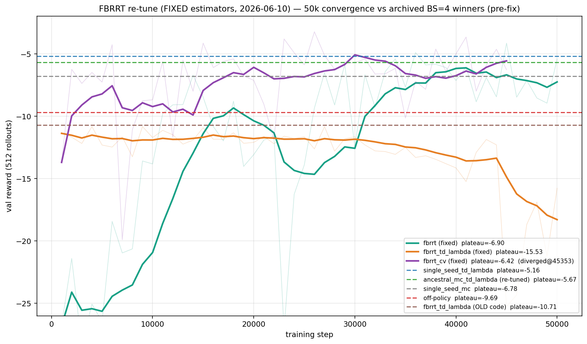

# FBRRT re-tune at BS=4 (fixed estimators) — can FBRRT match the other methods?

**Date:** 2026-06-10 · **Device:** RTX 3090 Ti (9 parallel workers) ·
**Code:** post-fix (`37c029d`/`2fd7535`; estimator fixes `57926d6`, `13ef36a`, `c6b70ee`)
**Supersedes (for FBRRT):** the FBRRT rows of [`../2026-05-28/bs4_experiments_summary.md`](../2026-05-28/bs4_experiments_summary.md)

## TL;DR

With the fixed estimators, **FBRRT jumps from last place to mid-pack**: the best
variant (`fbrrt_cv`, plateau **−6.42**) now **beats tuned off-policy (−9.69) by
~1.5×** and edges `single_seed_mc` (−6.78), with the fastest convergence of the
study (17k steps, tied with the amctl re-tune). The old-code FBRRT result
(−10.71, *worse* than off-policy) is fully explained by the bugs: same family,
same benchmark, +4.3 reward after the fixes. FBRRT does **not** (yet) overtake
the two SMC-twist TD(λ) leaders (`single_seed_td_lambda` −5.16,
`ancestral_mc_td_lambda` −5.67), though `fbrrt_cv`'s best smoothed reward
(−5.07) reaches their territory transiently.

## Results — 50k convergence vs the archived winners

| config | code | plateau | best smoothed | conv. step | final LCB |
|---|---|---:|---:|---:|---:|
| `single_seed_td_lambda` | archived | −5.16 | — | 25,999 | −5.72 |
| `ancestral_mc_td_lambda` (re-tuned) | archived | −5.67 | — | 16,999 | −5.67 |
| **`fbrrt_cv`** | **fixed** | **−6.42** | **−5.07** | **16,999** | **−6.60** |
| `single_seed_mc` | archived | −6.78 | — | 28,999 | −7.50 |
| **`fbrrt`** | **fixed** | **−6.90** | −6.11 | 33,999 | −7.45 |
| off-policy | archived | −9.69 | — | 25,999 | −11.08 |
| `fbrrt_td_lambda` | pre-fix (old) | −10.71 | — | 40,999 | −14.48 |
| **`fbrrt_td_lambda`** | **fixed** | −15.53 | −11.36 | — | −16.47 |

Archived rows are the 2026-05-28 study (same task, objective, LCB metric,
budgets, BS=4). The plateau is the smoothed-tail mean of 512-rollout validation
reward over 50k steps.

### Winning hyperparameters

| method | winner | key params |
|---|---|---|
| `fbrrt_cv` (t14) | LCB −10.0 ± 2.8 @5k | mc=28, branch=8, n_steps=12, α=0.73, **ent_λ=4.37**, **ema_decay=0.932** (EMA policy), off_frac=0.37, lr=2.1e-4, quad |
| `fbrrt` (t81) | LCB −12.7 ± 4.4 @5k | mc=11, branch=7, n_steps=21, **α=0.23**, **ent_λ=∞**, off_frac=0.06, lr=1.8e-4, quad |
| `fbrrt_td_lambda` (t47) | LCB −16.3 ± 4.4 @5k | mc=6, branch=11, n_steps=47, α=0.08, ent_λ=0.17, **λ_eff=0.92**, off_frac=0.47, lr=1.1e-4, **mse** |

## Methodology

Same three-phase pipeline as the archived study (and its amctl post-fix
re-tune): TPE+Hyperband sweep at 5k steps with the detrended-SEM LCB objective →
top-3 × 5-seed confirm → 50k-step convergence of the confirmed winner, all at
gradient BS=4 on the moons/GMM task.

Differences from the archived FBRRT sweep, all deliberate:

- **One Optuna study per method** (80 trials each, 240 total) instead of a
  combined `method` categorical — a combined TPE concentrates trials on
  whichever method looks best early, so a slow-starting method can be a false
  negative purely from under-exploration. 80 trials/method matches the budget
  the single-method amctl re-tune received.
- **Parallel execution** (`run_parallel.sh`): 9 concurrent trainings
  (3 workers × 3 methods, JournalStorage + constant-liar TPE +
  per-study `MaxTrialsCallback`), GPU at ~99% utilization; the full
  sweep+confirm+converge pipeline took ~75 minutes wall-clock.
- **Search space**: branch extended to 2–16 (old cap 10 was binding),
  `entropy_λ ∈ {∞} ∪ logU[0.05, 5]` (∞ = uniform resampling + unweighted
  regression — not representable in the old sweep), `ema_decay` for the
  `fbrrt_cv` frozen-policy EMA, `fbrrt_mc_z` excluded (documented divergent).
- **Convergence-phase guard**: the quad loss NaNs on a single extreme-negative
  target (`exp(target)·target² = 0·∞`), which a rare far-field particle
  eventually produces over 50k steps. Convergence runs skip such batches (cap
  200 consecutive); sweep/confirm keep the hard failure so fragile configs are
  penalized during selection.

### Code fixed since the archived run

1. The four FBSDE backward-pass fixes (entropy weights off the target;
   ancestor-aligned TD(λ) + multinomial resampling; corrected CV driver +
   Malliavin scaling; right-endpoint child-time driver gradients) — see
   [`../../data_quality/2026-06-10/REPORT.md`](../../data_quality/2026-06-10/REPORT.md).
2. **A `ValueNetwork` init singularity discovered while setting up this
   experiment**: the zero-initialized input-projection bias made the LayerNorm
   Jacobian compound to a ~3×10⁷ input-gradient at exactly `x=0` *at init*.
   FBRRT is the only method that differentiates the fresh network at the origin
   (its seed particles), so its drift teleported all particles to `|x|~10⁵` on
   the first step of every run — labels were poisoned from step 0 in the
   archived study. Fixed at the source (`input_proj.bias ~ N(0, 0.1)`) plus a
   norm-clip guard on the FBRRT control, made exactly bias-free by using the
   actually-applied control in the Girsanov driver term.
3. `fbrrt_cv` through the dataset now uses a genuinely *frozen* policy
   (`smc_value` = EMA shadow) instead of `v_policy = v_target` (which had made
   it identical to plain `fbrrt`).

## Analysis

- **The old FBRRT result was an artifact.** Bias bugs in the targets plus the
  origin-gradient catapult fully account for the archived "weakest and slowest"
  verdict; with both fixed, the same family at the same budgets gains ~4.3
  plateau reward and converges 2.4× faster.
- **`fbrrt_cv` is the family's best variant**, and its winning config uses the
  machinery the fixes enabled: a *lagged* EMA policy (decay 0.932) with the
  residual control variate active, moderate guidance (α=0.73), and a finite
  entropy temperature whose weights now (correctly) act on the regression loss.
  Its remaining weakness is long-horizon stability: the winner diverged at step
  45k (caught by the skip-guard after 201 consecutive bad batches; curve
  salvaged — the plateau is measured before the divergence, which is visible in
  the plot).
- **Plain `fbrrt` prefers gentle guidance** (α=0.23, uniform resampling) and is
  the most stable of the three (zero skipped batches over 50k steps).
- **`fbrrt_td_lambda` remains the laggard and degrades late in training**
  (peaks ~−11 at 20k, then declines). Notably its TPE winner sits in the regime
  the code documents as value-biased: finite `entropy_λ` (0.17) combined with
  heavy multi-step (λ_eff=0.92) — the ancestry scatter-mean over
  value-tilted survivors is only unbiased at `entropy_λ=∞`. The 5k-step LCB
  couldn't see the late degradation. A constrained re-tune (forcing
  `ent_λ=∞` for λ_eff>0, or jointly annealing) is the obvious follow-up; for
  multi-step returns the `ancestral_mc_td_lambda` estimator (log-space,
  ancestor-exact) remains the better choice.
- **Answer to the headline question:** FBRRT now clearly exceeds the off-policy
  baseline and matches the mid-tier on-policy methods, but the simple
  SMC-twist TD(λ) methods still hold the top of this benchmark. FBRRT's
  distinguishing asset — gradient-guided exploration — may matter more in
  higher dimensions than on this 2-D task; the dim-scaling benchmark is where
  the comparison should go next.

## Caveats

- The archived non-amctl rows were produced on Apple MPS (this run: CUDA), as
  was already true for the amctl re-tune comparison.
- The convergence skip-guard is a converge-phase-only stabilizer; per-run skip
  counts are recorded in `conv_*_t*.json` (`fbrrt` 0, `fbrrt_td_lambda` 0,
  `fbrrt_cv` 201-at-divergence).
- 5k-LCB remains an imperfect proxy for 50k behavior (`fbrrt_td_lambda`'s late
  degradation; the archived study saw similar ranking instability).

## Artifacts

| file | contents |
|---|---|
| `optuna_fbrrt_bs4_sweep.py` | per-method sweep/confirm/converge pipeline |
| `run_parallel.sh` | staged parallel launcher (9 workers) |
| `optuna_fbrrt2_journal.log` | Optuna JournalStorage (all 3 studies + the 16-trial pre-split combined study) |
| `optuna_fbrrt2_bs4_sweep_{method}_results.json` | per-method results (sweep top, confirm, convergence + curve) |
| `optuna_fbrrt2_bs4_sweep_{method}.png` | per-method confirm/convergence plots |
| `conv_{method}_t{n}.json` | raw convergence records (incl. `diverged_at`, `nonfinite_skips`) |
| `fbrrt2_summary_convergence.png`, `make_report_assets.py` | cross-method comparison plot/table |
| `checkpoints/optuna_fbrrt2_{method}_converge/…` | best/last ckpts + `value_module.pt` per winner |

Reproduce: `KPM=3 OPT_N_TRIALS=80 bash experiments/bs4_moons/2026-06-10/run_parallel.sh`
(stages are idempotent and resumable).

---

# Addendum (2026-06-11): loss stabilization, quad-only re-sweeps, and the gradient-channel studies

The initial convergence runs above exposed a chain of numerical-stability
issues whose diagnosis and fixes substantially change the FBRRT picture.
Chronology and findings:

## 1. Loss-level fixes

- **Quad loss**: the naive autograd of the log-quadratic Bregman divergence is
  NaN for predictions > ~88 nats (Spence backward inf/inf) — one prediction
  spike silently poisoned all 2.9M weights through Adam (forensics: post-crash
  `value_module.pt` 100% non-finite, zero non-finite losses ever logged).
  Replaced with an exact closed-form gradient `p(e^p−e^q)/(e^p−1)` (verified
  symbolically), finite for all floats; the loss VALUE is sanitised for
  monitoring only.
- **MSE loss**: `(e^p−e^q)²` overflows float32 for predictions > ~44 nats; the
  v1 `fbrrt_td_lambda` winner (an mse config) skipped 18% of its convergence
  batches.  Same value/gradient split applied (`losses/exp_mse.py`).
- Non-finite predictions now fail fast before backward; FBRRT resampling
  weights and the control clip are sanitised (NaN data / CUDA asserts).

## 2. Quad-only re-sweeps (fresh 80-trial studies per method)

Budget analysis showed 49%/63%/40% of the v1 fbrrt/td_lambda/cv sweeps went to
mse configs, whose 5k-step LCBs look competitive but degrade over 50k —
worst for td_lambda, where TPE concentrated ON mse and crowned a winner that
collapsed at convergence.  Quad-only results: `fbrrt` t58 (plateau −6.75
single-seed), `fbrrt_cv` t0 (−7.82, no divergence), `fbrrt_td_lambda` t6
(−29.6: the variant, not the loss, is the problem).

## 3. The 2×2 gradient/value probe

Perturbing the *oracle* V on the GMM benchmark and measuring FBRRT target
quality: **the value-gradient channel dominates by ~2 orders of magnitude per
nat of error** (gradient error 50 with a near-perfect value: bias 26, var 833,
particles 6× off-manifold; value error 50: bias 4, var 2.5; a pure value
offset changes nothing but the offset).  Mechanism: ∇V enters the dynamics
(distribution feedback) and the targets quadratically (the `|∇v|²` driver),
while V enters linearly/allocatively.  Even "extreme value" damage is
mediated by its incidental gradient.

## 4. Gradient-stabilization studies (pinned winners, multi-seed)

**td11 lever study** (12 arms × 3 seeds × 25k): only the EMA generation
network eliminates divergence (ema999 and the kitchen-sink: 0/3 deaths);
the `grad_decay` L2 penalty is load-bearing (ablation: 3/3 deaths) but
stronger over-smooths; magnitude clips (drift/driver/optimizer) and α-warmup
reduce but never eliminate deaths.

**Strong-variant study** (10 arms × 3 seeds × **50k**,
`fbrrt_stabilization_results.json`):

| arm | plateau (3 seeds) | best | deaths |
|---|---:|---:|---:|
| f58_base (live net) | −25.2 ± 5.0 | −14.3 | 0 |
| **f58_ema99 (target network)** | **−6.34 ± 0.56** | **−5.49** | **0** |
| f58_ema999 | −9.33 ± 1.2 | −7.05 | 0 |
| f58_hybrid (EMA grads + live values) | −14.5 ± 12.7 | −12.4 | 0 |
| cv14_base (policy-EMA 0.932, tuned) | −5.58 ± 0.67 | −4.98 | 1/3 |
| cv14_ema99 | −6.44 ± 1.4 | −5.70 | 0/3 |
| cv14_ema999 | −5.60 ± 0.7 | −5.02 | 1/3 |
| td11_base | −18.3 ± 11.0 | −11.4 | 3/3 |
| td11_ema999 | −13.9 ± 5.1 | −8.76 | 0/3 |
| td11_hybrid | −17.1 ± 8.3 | −16.3 | 1/3 |

Key lessons:

- **Single-seed convergence numbers are unreliable** (f58 live: −6.75 on the
  lucky converge seed vs −25.2 ± 5.0 over 3 fresh seeds).  The multi-seed rows
  above supersede the single-run table in the main report.
- **The EMA target network is the decisive stabilizer** and transforms plain
  `fbrrt`: −25 → **−6.34 ± 0.56 with zero deaths** — the first multi-seed-
  robust FBRRT result, just behind the SMC-twist leaders (−5.16/−5.67).
  Decay 0.99 beats 0.999 (target staleness, as predicted).
- **Hybrid (EMA gradients + live bootstrap values) loses to the full EMA on
  both variants tried.**  Although mathematically unbiased-at-convergence,
  mid-training it pairs values and gradients from different functions
  (per-step mismatch bias) and re-opens the fast value-feedback loop; the
  full target network's (value, gradient) pair is self-consistent.
- **`fbrrt_cv` inverts the decay direction**: its RCV residual scales with
  `v_target − v_policy`, so a slower policy EMA *widens* the residual and
  feeds the `|z_rcv|²` driver — TPE's tuned 0.932 was right; cv's occasional
  late death (~1/3 of 50k runs) is not fixed by EMA speed and remains the
  family's open stability issue (cv14_ema99 trades ~0.9 plateau for 0/3
  deaths).
- `fbrrt_td_lambda` is stable under ema999 (0/3 at both 25k and 50k) but
  uncompetitive (~−14); the variant is deprioritised in favour of
  `ancestral_mc_td_lambda` for multi-step.

## Recommended configurations (multi-seed, 50k, BS=4)

| config | plateau | deaths | note |
|---|---:|---:|---|
| `fbrrt` t58 + EMA(0.99) generation | **−6.34 ± 0.56** | 0/3 | robust recommendation |
| `fbrrt_cv` t14 (tuned, policy-EMA 0.932) | −5.58 ± 0.67 | 1/3 | best plateau, accepts rare late death |
| `fbrrt_cv` t14 + policy-EMA 0.99 | −6.44 ± 1.4 | 0/3 | the safe cv |

Reference: `single_seed_td_lambda` −5.16, `ancestral_mc_td_lambda` −5.67,
`single_seed_mc` −6.78, off-policy −9.69 (archived single-seed numbers).
