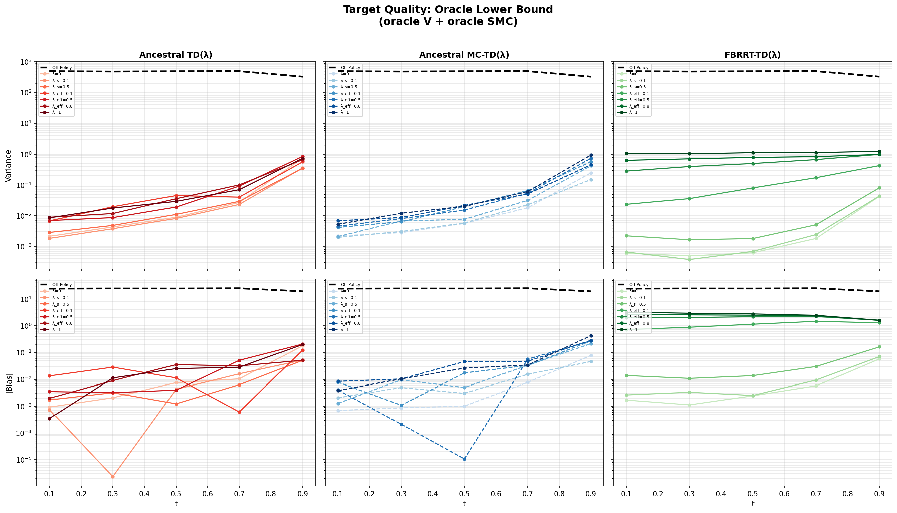
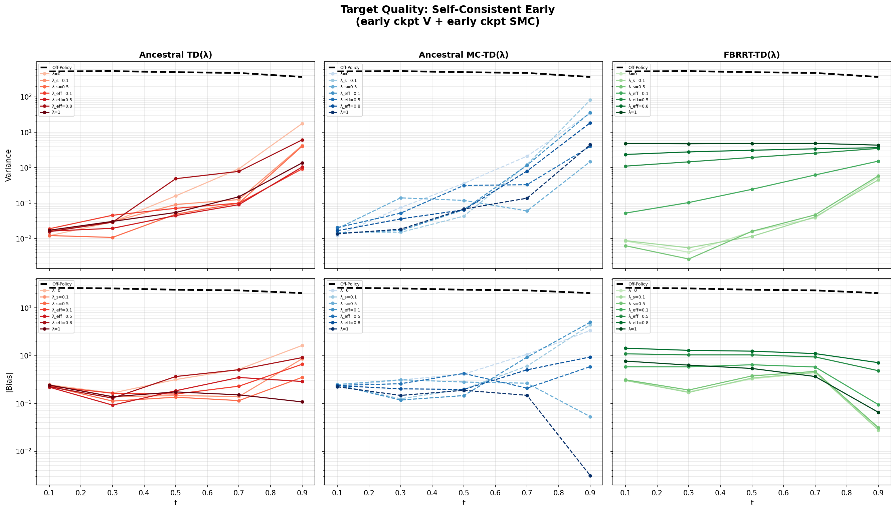
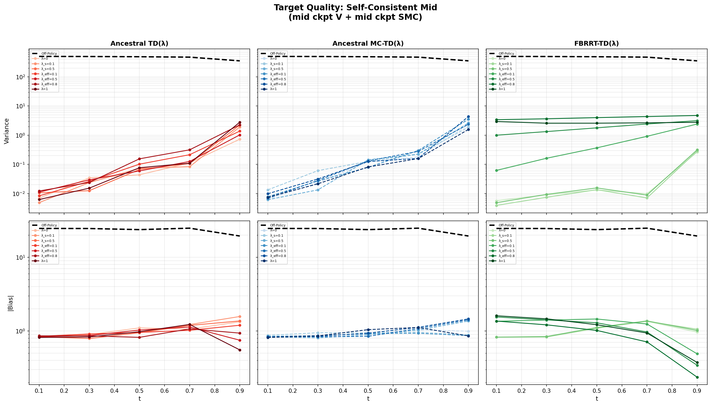
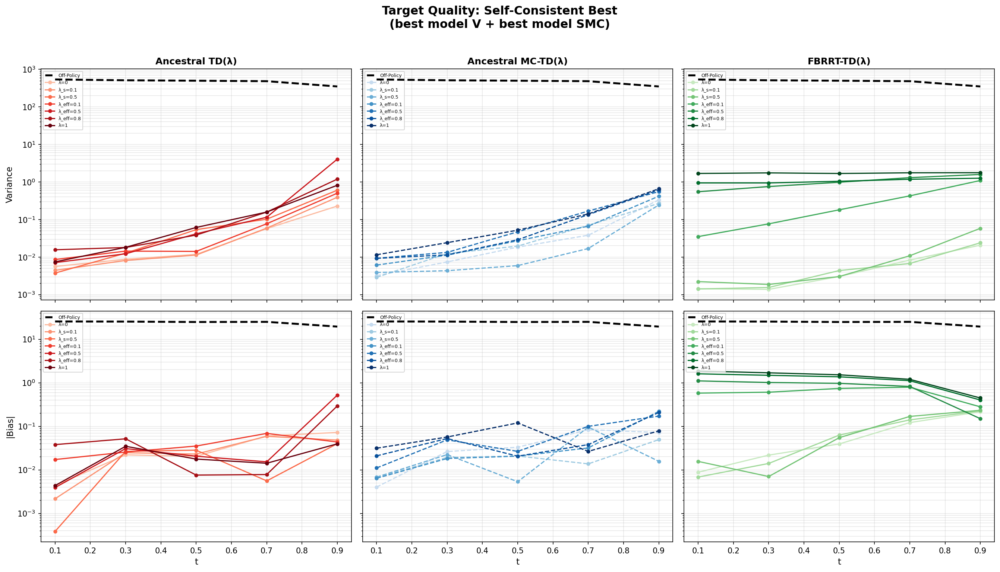

# Data Quality: Target Bias-Variance Analysis

This report compares the target quality (bias and variance relative to the analytical value function) for three on-policy sampling method families across the λ spectrum, plus an off-policy baseline.

**Methods:**
- **Off-Policy** (baseline) — forward-noised samples from p₁ with reward targets r(x₁)
- **Ancestral TD(λ)** — N-particle SMC with resampling; TD(λ) targets with duplicate averaging
- **Ancestral MC-TD(λ)** — N-particle SMC; MC-style TD(λ) with logZ corrections
- **FBRRT-TD(λ)** — gradient-guided drift (u = ∇V), branching (4 children/parent), systematic resampling

**Lambda values** (per-step λ / effective λ_eff):

| Label | Per-step λ | Description |
|-------|--------:|---|
| λ=0 | 0 | Pure one-step bootstrap |
| λ_s=0.1 | 0.1 | 10% multi-step per step |
| λ_s=0.5 | 0.5 | 50% multi-step per step |
| λ_eff=0.1 | 0.977 | Near-MC |
| λ_eff=0.5 | 0.993 | Near-MC |
| λ_eff=0.8 | 0.998 | Near-MC |
| λ=1 | 1.0 | Pure multi-step (MC) |

**Setup:** 2D moons GMM (100 components), r(x) = -10‖x - c‖², n_steps=100, mc_samples=10, N_PER_BIN=1000.

---

## Stage 1: Oracle Lower Bound (oracle V + oracle SMC)

*Both value function and SMC twist are the analytical truth. Shows intrinsic method variance at optimality.*

| Method | λ=0 var | λ_s=0.1 var | λ_s=0.5 var | λ=1 var |
|--------|--------:|--------:|--------:|--------:|
| **FBRRT-TD** | **0.009** | **0.010** | **0.018** | 1.124 |
| AMCTD | 0.055 | 0.037 | 0.094 | 0.208 |
| ATD | 0.160 | 0.080 | 0.080 | 0.174 |
| Off-Policy | 457.7 | — | — | — |

**Findings:** FBRRT dominates at low λ, achieving **6× lower variance** than AMCTD and **18× lower** than ATD at λ=0. The gradient-guided drift produces particles in optimal regions, dramatically reducing target variance. All three methods are near-unbiased (|bias| < 0.05) at low λ.

At high λ (λ_eff ≥ 0.1), FBRRT degrades sharply — both variance and bias increase by orders of magnitude. The multi-step returns in FBRRT accumulate errors from the BSDE driver correction. ATD and AMCTD are more robust to high λ, staying below var=0.2 across the full range.

**Best config:** FBRRT at λ=0 or λ_s=0.1 (var ≈ 0.01).

---

## Stage 2: Self-Consistent Early (early checkpoint V + early checkpoint SMC)

*Early model (~step 3600). Substantial model error; tests robustness to a bad value function.*

| Method | λ=0 var | λ_s=0.5 var | λ=1 var |
|--------|--------:|--------:|--------:|
| **FBRRT-TD** | **0.122** | **0.132** | 4.697 |
| ATD | 3.745 | 0.844 | 0.324 |
| AMCTD | 7.420 | 0.366 | 0.936 |
| Off-Policy | 476.6 | — | — |

**Findings:** FBRRT maintains its advantage at λ=0, achieving **31× lower variance** than ATD. The gradient-guided drift provides reasonable targets even with a bad value function, because ∇V still points in roughly the right direction even when V is inaccurate.

Strikingly, ATD and AMCTD at low λ are *worse* with the early model than with the oracle — ATD(λ=0) jumps from 0.16 to 3.74 (23× worse). Their reward-based SMC resampling can't compensate for the poor V. At higher λ, ATD and AMCTD improve (more multi-step return = less bootstrap dependence), while FBRRT degrades.

**Best config:** FBRRT at λ=0 (var=0.12).

---

## Stage 3: Self-Consistent Mid (mid checkpoint V + mid checkpoint SMC)

*Mid model (~step 10400). Improving but not converged; intermediate model quality.*

| Method | λ=0 var | λ_s=0.5 var | λ=1 var | λ=0 \|bias\| |
|--------|--------:|--------:|--------:|--------:|
| **FBRRT-TD** | **0.060** | **0.071** | 2.707 | 1.014 |
| ATD | 0.186 | 0.487 | 0.601 | 1.044 |
| AMCTD | 0.528 | 0.605 | 0.370 | 0.930 |
| Off-Policy | 463.7 | — | — | 23.4 |

**Findings:** All methods show **high bias** (~1.0) regardless of λ — the mid model's value function has systematic error that no λ setting can fix. The bias reflects the model's actual prediction error, not a sampling artifact.

FBRRT still achieves the lowest variance (0.060 at λ=0, **3× better** than ATD), but the advantage is smaller than with the oracle. The mid model's gradients are better than early but not great.

**Best config:** FBRRT at λ=0 (lowest variance), but bias is dominated by model error at all λ.

---

## Stage 4: Self-Consistent Best (best model V + best model SMC)

*Best off-policy trained model. Closest to the practical training scenario.*

| Method | λ=0 var | λ_s=0.1 var | λ_s=0.5 var | λ=1 var |
|--------|--------:|--------:|--------:|--------:|
| **FBRRT-TD** | **0.007** | **0.008** | **0.015** | 1.729 |
| AMCTD | 0.080 | 0.075 | 0.055 | 0.178 |
| ATD | 0.062 | 0.095 | 0.155 | 0.213 |
| Off-Policy | 476.3 | — | — | — |

**Findings:** With a good model, FBRRT recovers its full advantage: **9× lower variance** than ATD/AMCTD at λ=0. All methods have low bias (< 0.1 at low λ), confirming that the best model's V is accurate.

FBRRT's sensitivity to λ remains: at λ_eff=0.1, variance jumps 50× (0.007 → 0.363) and bias jumps 7× (0.08 → 0.60). ATD and AMCTD are much more robust across λ.

**Best config:** FBRRT at λ=0 (var=0.007, bias=0.082).

---

## Summary

### 1. FBRRT-TD(λ) Achieves the Lowest Variance at Low λ

Across all stages, FBRRT at λ=0 achieves 3-31× lower variance than ATD/AMCTD. The gradient-guided drift concentrates particles where they matter most.

| Stage | FBRRT(λ=0) var | ATD(λ=0) var | Improvement |
|-------|--------:|--------:|--------:|
| Oracle | 0.009 | 0.160 | 18× |
| Early | 0.122 | 3.745 | 31× |
| Mid | 0.060 | 0.186 | 3× |
| Best | 0.007 | 0.062 | 9× |

### 2. FBRRT is Fragile at High λ

FBRRT-TD degrades sharply when λ_eff ≥ 0.1. Both variance and bias increase by 1-2 orders of magnitude. The BSDE driver correction in the multi-step return accumulates errors along the trajectory. ATD and AMCTD are much more robust across the full λ spectrum.

### 3. Model Quality Affects Methods Differently

- **FBRRT**: Robust to model quality at low λ (relies on ∇V direction, not magnitude). Early model: var=0.12; best model: var=0.007.
- **ATD/AMCTD at low λ**: Sensitive to model quality (bootstrap targets directly use V). Early model: var=3.7-7.4; best model: var=0.06-0.08.
- **ATD/AMCTD at high λ**: More robust to bad models (multi-step returns reduce bootstrap dependence).

### 4. Bias is Dominated by Model Error

At the mid checkpoint, all methods show |bias| ≈ 1.0 regardless of λ or method — the bias reflects V's systematic error, not a sampling choice. Only at the oracle and best model stages does bias become small enough for λ and method choice to matter.

### 5. Practical Recommendations

- **Use FBRRT at λ=0** when a reasonable V is available — lowest variance by far
- **Avoid high λ with FBRRT** — variance and bias explode at λ_eff ≥ 0.1
- **ATD/AMCTD are safer across λ** — use when you need multi-step returns or when V quality is uncertain
- **Off-policy targets** have correct (zero) bias but ~10,000× higher variance than on-policy methods
