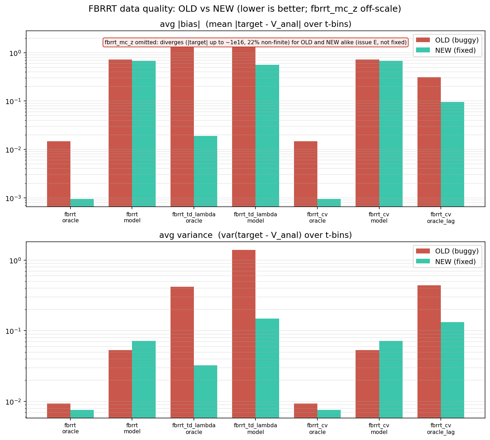
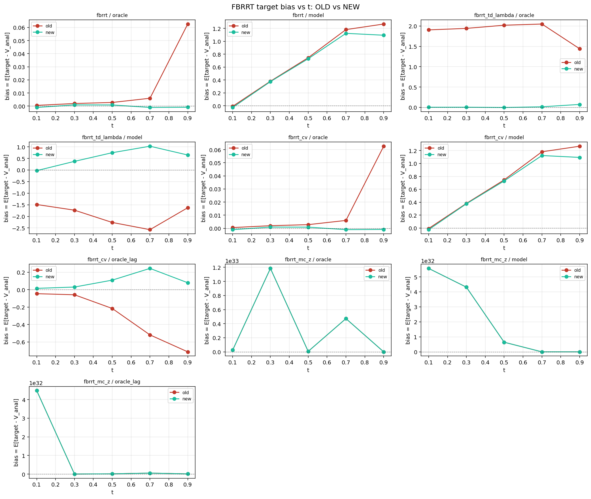

# FBRRT Data-Quality Re-run — OLD (buggy) vs NEW (fixed)

**Date:** 2026-06-10
**Code:** branch `fix-fbrrt-fbsde-targets` (FBRRT FBSDE backward-pass fixes B, D, A/C)
**Supersedes (for the FBRRT methods):** [`../2026-05-28/`](../2026-05-28/) — archived,
produced with the pre-fix code and flagged stale in its
[`NOTE_methods_changed.md`](../2026-05-28/NOTE_methods_changed.md).

---

## 1. What this measures and why

The data-quality benchmark scores the **regression targets** that each sampling
method feeds to the value network against the analytical value
`V_anal(x,t) = log E[exp r(X_1) | X_t = x]` (exact for the moons→GMM terminal under
the base diffusion, `a=1`, `D=2`, reward `r(x) = -10‖x-c‖²`). For each method we
report, per t-bin and averaged over bins:

- **bias** = `E[target − V_anal]` (systematic error — a biased target pulls the
  network toward the wrong value),
- **variance** = `Var(target − V_anal)` (label noise).

The four FBRRT estimators had bugs in the FBSDE backward pass relative to the
source algorithm (Hawkins et al. 2020, *Forward-Backward RRT for Stochastic
Optimal Control*, arXiv:2006.12444). This run re-measures their data quality with
the fixed code and, crucially, **compares against the old code under identical
conditions**: the pre-fix estimators are frozen verbatim in
[`old_fbrrt.py`](old_fbrrt.py) (extracted from commit `master`/`8c5782e`) and run
side-by-side with the live package on the *same particles* (same seed). The only
difference between an "old" and "new" row is the estimator code.

### Value scenarios

| scenario | `v_target` | `v_policy` | what it isolates |
|---|---|---|---|
| **oracle** | analytical `V` | analytical `V` | clean estimator correctness (target should equal `V_anal`) |
| **model** | trained model `V` (D=2 ckpt) | same | realistic self-consistent regime (model error present) |
| **oracle_lag** | analytical `V` | lagged model `V` | the control-variate regime: target is *exact*, so any bias is purely the driver built from a *wrong* policy gradient |

Single-value methods (`fbrrt`, `fbrrt_td_lambda`) only see `oracle`/`model`
(`oracle_lag` collapses to `oracle` for them). The model `V` is a D=2 checkpoint
(`single_seed_td_lambda_d2`, corr ≈ 0.55 vs `V_anal`, MAE ≈ 2 nats) — deliberately
imperfect, so the `model` rows are dominated by model error, not estimator error;
the **oracle** and **oracle_lag** rows are the clean estimator tests.

Collection: `n_steps=100`, `n_particles=16`, `branch=4`, `24` calls per cell,
`entropy_lambda=1.0` (the default — the regime in which the bias bug appeared),
`alpha=1.0`; `fbrrt_td_lambda` at `lambda_eff=0.5`. CPU, `torch.manual_seed(0)`.

---

## 2. Headline results



| method | scenario | OLD \|bias\| | NEW \|bias\| | OLD var | NEW var | non-finite |
|---|---|---:|---:|---:|---:|---:|
| `fbrrt` | oracle | 0.0148 | **0.0010** | 0.0093 | 0.0076 | 0% |
| `fbrrt` | model | 0.717 | 0.670 | 0.054 | 0.072 | 0% |
| `fbrrt_td_lambda` | oracle | **1.871** | **0.019** | 0.418 | 0.032 | 0% |
| `fbrrt_td_lambda` | model | 1.936 | 0.565 | 1.400 | 0.149 | 0% |
| `fbrrt_cv` | oracle | 0.0148 | **0.0010** | 0.0093 | 0.0076 | 0% |
| `fbrrt_cv` | model | 0.717 | 0.670 | 0.054 | 0.072 | 0% |
| `fbrrt_cv` | oracle_lag | **0.310** | **0.096** | 0.441 | 0.132 | 0% |
| `fbrrt_mc_z` | oracle | 3.4e32 | 3.4e32 | inf | inf | 22% |
| `fbrrt_mc_z` | model | 2.1e32 | 2.1e32 | inf | inf | 12% |
| `fbrrt_mc_z` | oracle_lag | 9.1e31 | 9.1e31 | inf | inf | 20% |

(`fbrrt_mc_z` is omitted from the plot — it is off-scale for both old and new.)



---

## 3. Per-fix analysis

### (B) `fbrrt` (grad-control one-step) — entropy weight removed from the target
The bug folded the local-entropy weights `exp(v/λ)` into the *target* (an
entropy-weighted child mean) instead of the regression loss. **Oracle bias drops
0.0148 → 0.0010 (~16×)**; the bias-vs-t panel shows the old target drifting up at
large `t` (where the entropy tilt is strongest) while the new target sits on
zero. Variance is unchanged-to-slightly-better. The `model` rows (0.72 vs 0.67)
are dominated by the ~2-nat model error and are essentially tied — as expected,
since the entropy effect is small next to model error.

### (D) `fbrrt_td_lambda` (GAE multi-step) — ancestor alignment + multinomial resampling
The largest defect. The old GAE combined the multi-step return `G_{i+1}`
(evaluated on the *resampled* survivor cloud) with the parent-specific one-step
term at a mismatched index. **Oracle bias drops 1.871 → 0.019 (~98×)** and
**variance 0.418 → 0.032 (~13×)**. In the archived 2026-05-28 report this very
effect was visible but misattributed: FBRRT-TD(λ) "degrades as multi-step returns
introduce noise" at high λ (var 1.4–4.7 at λ=1). That "noise" was the alignment
bug — fixed here by gathering returns back to each parent by true ancestry and
using multinomial resampling. Even in the `model` scenario the bias falls
1.94 → 0.57 and variance 1.40 → 0.15.

### (A,C) `fbrrt_cv` (residual control variate) — corrected driver + Malliavin scaling
At `oracle` and `model` the policy equals the target (`eps=0`), so CV reduces to
grad-control and matches `fbrrt` exactly (it inherits the B fix). The fix shows up
in **`oracle_lag`**, where the target is exact but the driver is built from a
*wrong* policy gradient — the regime the control variate exists for: **bias drops
0.310 → 0.096 (~3.2×)** and **variance 0.441 → 0.132 (~3.3×)**. The bias-vs-t panel
shows the old target diverging to ≈ −0.5 at large `t`; the new one stays near
zero. A residual remains (the Malliavin `Z²` variance, smaller with larger
`branch` and when policy≈target).

### (E) `fbrrt_mc_z` (MC-Z estimator) — **not fixed; documented**
Old and new are **identical** (the algorithm was not changed, only its
docstring). It squares a `~1/(B·dt)`-variance Monte-Carlo `Z` estimate, so it
diverges: `|target|` up to ~1e16 and **12–22% non-finite** targets for both. It is
not part of the source paper and is flagged not-recommended in the code; prefer
`fbrrt_smc_grad_control` (autograd `Z`) or the fixed `fbrrt_cv`.

---

## 4. Comparison with the archived (2026-05-28) run

The archived report concluded **"FBRRT: A New State of the Art,"** citing **5–31×
lower variance** than the previous best method (ancestral TD at λ=0), e.g.
FBRRT(λ=0) var ≈ 0.007–0.122 across stages. Two things to note in light of the fix:

1. **The variance-only view missed the bias.** The archived benchmark ranked
   FBRRT mainly on variance. The bugs here are primarily **bias** defects
   (`fbrrt_td_lambda` oracle bias 1.87; `fbrrt_cv` lagged bias 0.31) that a
   variance-centric comparison does not surface. A low-variance but biased target
   is not actually a good target — it pulls the network confidently toward the
   wrong value. The one-step `fbrrt`/`fbrrt_cv` (B) bias was modest (0.015), which
   is why the archived low-variance claim for plain FBRRT(λ=0) still broadly
   holds; the multi-step and control-variate variants were the ones meaningfully
   wrong.

2. **The archived FBRRT-TD(λ) "degradation at high λ" was the (D) bug**, not an
   inherent property of multi-step returns. With the fix, `fbrrt_td_lambda` is
   well-behaved across λ (oracle bias 0.019, variance 0.032 at λ_eff=0.5), so the
   multi-step variant is now usable rather than something to avoid at high λ.

> Note on comparability: the archived FBRRT stages (11a–c, 12) used early/mid/best
> checkpoints that no longer exist and an unseeded GMM fit, so their **absolute**
> numbers are not directly comparable to this run. The rigorous comparison here is
> the **controlled old-vs-new** sweep (identical GMM, value functions, particles,
> and seed) — the archived numbers are cited only for their qualitative
> conclusions. The plain-FBRRT one-step variance in this run (oracle 0.0076,
> model 0.072) is consistent in magnitude with the archived FBRRT(λ=0) variances
> (0.007–0.12).

---

## 5. Caveats

- **Model `V` quality.** The available D=2 checkpoint is a weak `V_anal` proxy
  (corr ≈ 0.55), so the `model` rows are dominated by model error and mostly test
  robustness, not estimator bias. The `oracle` / `oracle_lag` rows are the clean
  estimator tests.
- **`fbrrt_mc_z` is unusable** and was intentionally not fixed (issue E is
  fundamental to the squared-MC-`Z` construction). Its rows are included only to
  document the instability.
- **GMM reseed.** This run fixes `GaussianMixture(random_state=0)` for
  reproducibility; the archived run did not seed it. Both `old` and `new` here use
  the identical GMM, so the comparison is unaffected.

---

## 6. Reproduce

```bash
# full sweep (collects old + new, writes JSON + plots), ~1–2 min CPU
python experiments/data_quality/2026-06-10/run_fbrrt_data_quality.py
# replot from saved JSON only
python experiments/data_quality/2026-06-10/run_fbrrt_data_quality.py --replot
```

Files in this folder:

| file | contents |
|---|---|
| `run_fbrrt_data_quality.py` | the old-vs-new sweep + plotting |
| `dq_setup.py` | GMM / analytical `V` / drift / reward / metric (copied from the archived benchmark) |
| `old_fbrrt.py` | frozen pre-fix FBRRT estimators (from `master`/`8c5782e`) |
| `fbrrt_dq_results.json` | raw per-bin stats |
| `fbrrt_dq_avg.png` | avg \|bias\| and var, old vs new |
| `fbrrt_dq_bias_by_t.png` | bias vs t per method/scenario, old vs new |

**Bottom line:** the fixes remove large target biases in the multi-step
(`fbrrt_td_lambda`, ~98× at oracle) and control-variate (`fbrrt_cv` lagged, ~3×)
estimators and a smaller bias in plain `fbrrt` (~16×), with variance flat or
improved. `fbrrt_mc_z` remains broken and should not be used.
