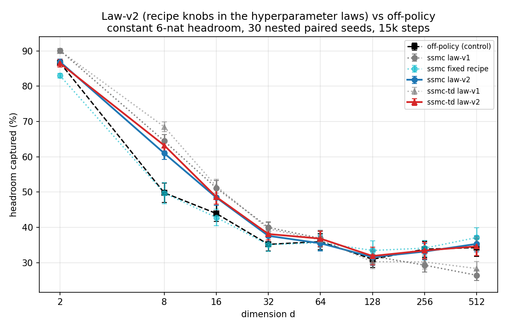

# Law-v2: recipe knobs inside the hyperparameter laws — report

**Question.** The fixed recipe (`../dim_scaling_recipe`) beat off-policy at
high dimension but cost up to −15 points vs the law-v1 configs at low
dimension; only a hand-switched *envelope* (law config d≤64, recipe d≥128)
covered off-policy everywhere. Can a single law *family* — with the recipe
knobs n_steps / expand_frac / epoch_rows swept and fitted vs log(d), and the
anchor set extended to d=512 — recover that envelope automatically?

**Answer: yes.** With one fitted config family per method, both ssmc and
ssmc-td now **match or beat off-policy at every dimension from 2 to 512**:
significantly above at d=8–32 (up to +13.4 paired), statistical ties
everywhere else, never significantly below. The hand-tuned envelope is no
longer needed.

## Design

Pipeline (`master_lawv2.sh`, all stages resumable): anchor TPE+Hyperband
sweeps (60 trials, 5k steps, LCB selection) for `single_seed_mc` and
`single_seed_td_lambda` at **d ∈ {2, 16, 128, 512}** — the d=512 anchor
removes the blind spot that produced law-v1's n_steps=19 — then Theil-Sen
laws on log(d) (LOO const-vs-slope, 10% bias toward constants), then the
paired grid (8 dims × 30 nested seeds, 15k steps). Search space = consth SMC
space plus `n_steps` (log 12..120), `expand_frac` ∈ [0,1] (backward-noising
expansion fraction), `epoch_rows` (log 768..16384 epoch cap = regeneration
cadence). Frozen methodology copies in this directory; controls
(off-policy, law-v1, fixed recipe) reused from the prior studies — identical
protocol, same nested instances/seeds. **480 grid seeds, zero errors.**

## Fitted laws (see hparam_fit_lawv2.md)

The anchors chose **nonzero expansion at every dimension** (top-trial
expand_frac 0.22–0.99, fit: const 0.46 for ssmc / 0.69 for ssmc-td) and
moderate constant n_steps (29 / 33) — NOT the fixed recipe's 60. Only lr
(rising) and ssmc-td's mc_samples (falling) earned slopes. Two implications:

- The fixed recipe's low-d damage came from its *un-co-adapted* config
  (frac=1.0 + n_steps=60 grafted onto law-v1 params), not from expansion per
  se — moderate expansion with co-tuned lr/twist is harmless-to-helpful even
  at d=2–8.
- At anchor budget, expansion and fine integration partially substitute for
  each other (several d=512 winners pair n_steps 12–15 with expand_frac
  ≈ 0.7–1.0); the laws settled on a middle point of that ridge, and it held
  up at the 15k-step plateau.

## Results (frac_closed %, mean ± s.e., n=30)

| series | d=2 | d=8 | d=16 | d=32 | d=64 | d=128 | d=256 | d=512 |
|---|---|---|---|---|---|---|---|---|
| off-policy (control) | 86.6±0.9 | 49.8±2.8 | 43.9±2.3 | 35.2±1.9 | 36.0±2.3 | 31.0±2.3 | 33.8±2.3 | 34.3±2.6 |
| ssmc law-v1 | 90.1±0.6 | 64.5±1.9 | 51.2±2.1 | 40.0±1.6 | 36.9±2.3 | 31.9±2.0 | 29.3±1.9 | 26.4±1.5 |
| ssmc fixed recipe | 83.0±0.7 | 49.7±3.0 | 42.8±2.4 | 35.1±1.9 | 35.7±2.3 | 33.5±2.7 | 34.1±2.2 | 37.1±2.7 |
| **ssmc law-v2** | 86.9±0.8 | 61.0±1.7 | 48.5±2.3 | 37.6±1.8 | 35.5±2.1 | 31.6±2.3 | 33.1±2.3 | 35.3±2.3 |
| ssmc-td law-v1 | 90.0±0.6 | 68.5±1.3 | 51.7±1.9 | 39.6±1.8 | 36.5±2.2 | 30.3±2.0 | 30.2±2.1 | 28.3±2.0 |
| **ssmc-td law-v2** | 86.5±1.0 | 63.2±1.6 | 48.6±2.1 | 38.1±1.7 | 36.8±2.2 | 31.9±2.5 | 33.4±2.3 | 34.6±2.7 |

Paired deltas (law-v2 − control, same seeds; `*` = p<0.05):

| ssmc law-v2 | d=2 | d=8 | d=16 | d=32 | d=64 | d=128 | d=256 | d=512 |
|---|---|---|---|---|---|---|---|---|
| vs off-policy | +0.3 | **+11.2*** | **+4.5*** | **+2.4*** | −0.5 | +0.6 | −0.7 | +1.1 |
| vs law-v1 | −3.2* | −3.5* | −2.7* | −2.4 | −1.4 | −0.3 | +3.9* | **+8.9*** |
| vs fixed recipe | +3.9* | **+11.3*** | +5.6* | +2.5* | −0.2 | −1.9 | −1.0 | −1.8 |

| ssmc-td law-v2 | d=2 | d=8 | d=16 | d=32 | d=64 | d=128 | d=256 | d=512 |
|---|---|---|---|---|---|---|---|---|
| vs off-policy | −0.2 | **+13.4*** | **+4.7*** | **+2.9*** | +0.8 | +0.9 | −0.4 | +0.4 |
| vs law-v1 | −3.5* | −5.3* | −3.0* | −1.4 | +0.3 | +1.6 | +3.2* | **+6.3*** |

## Readings

1. **One config family now covers off-policy everywhere.** Both methods:
   significantly above off-policy at d=8–32, ties at d=2 and d≥64, never
   significantly below at any dimension. The dimension-dependent
   hand-switch (envelope) is obsolete.
2. **The trade the laws made is small and one-sided.** Law-v2 gives up
   ~3 points to law-v1 at d≤16 (where both are far above off-policy anyway)
   and gains +6 to +9 at d≥256 (where law-v1 collapses below off-policy).
   Against the fixed recipe it is hugely better at low d (+11.3 at d=8) and
   statistically tied at d≥64.
3. **Remaining daylight (not significant):** the fixed recipe's d=512 point
   (37.1) sits 1.8 above law-v2's 35.3 (p>0.05), and law-v1 keeps ~3 points
   at d≤16. A per-dimension re-tune would likely close both, at the cost of
   abandoning the single-family property this study set out to test.

## Files

`sweep_lawv2.py` (anchor sweep incl. recipe knobs), `fit_lawv2.py` (laws →
`fitted_models_lawv2.json`, `hparam_fit_lawv2.md`), `run_lawv2_cell.py`
(grid cell), `plot_lawv2.py` (→ `lawv2_vs_offpolicy.png`, `summary.md`),
`master_lawv2.sh` (pipeline), frozen copies `problem_consth.py` /
`sweep_consth.py`; anchors + per-seed grid records in `results/`.
