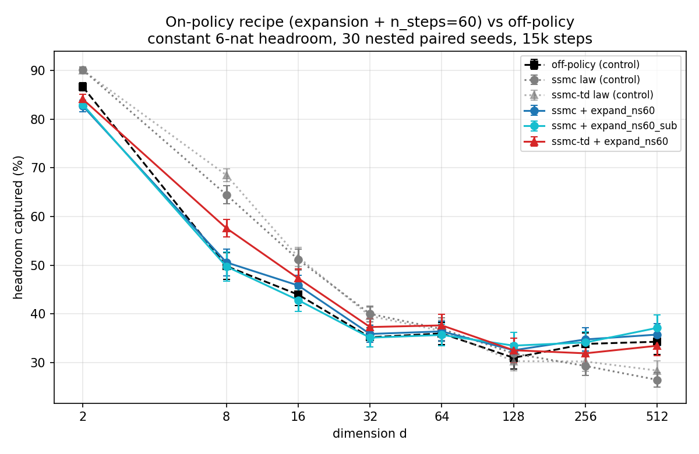

# The on-policy recipe vs off-policy, across dimension — report

**Question.** The `../dim_scaling_consth` probes found a recipe —
**backward-noising expansion + n_steps=60** — that put on-policy SMC above
off-policy regression at d=512 (paired seeds 0–9). Does it hold at full seed
count, and how does it behave across the whole dimension range?

**Headline.** At d=512 with all 30 paired seeds, **ssmc + expand_ns60_sub
beats off-policy with statistical significance** (+2.8±1.4, p=0.044, 20/30
seed wins) — the first on-policy configuration in the study to clear that
bar. But the recipe is a **high-dimension fix, not a universal one**: below
d≈64 it *costs* substantially relative to the law configs (up to −14.8 points
at d=8), eroding — though never quite erasing — the large low-d on-policy
advantage. The recipe and the law configs are complementary regimes; the
on-policy *envelope* (law config for d ≤ 64, recipe for d ≥ 128) matches or
beats off-policy at every dimension tested.

## Design

Identical methodology to `../dim_scaling_consth` (constant 6-nat headroom,
coordinate-nested paired instances, law-fitted hyperparameters, 15k steps,
frac_closed = fraction of headroom captured). Code frozen in this directory
(see README.md); controls reused from the consth grid (same protocol, same
instances/seeds); d=512 seeds 0–9 carried from probe 3 (RNG-identical code
path, verified). 3 arms × 8 dims × 30 seeds; **all 690 fresh seeds completed
with zero errors and zero non-finite skips.**

- `ssmc + expand_ns60` — law hparams + n_steps 19→60 + backward-noising
  expansion (k=1 per row).
- `ssmc + expand_ns60_sub` — same, epochs subsampled back to the law cadence
  (freshness-matched; removes the slow-data side effect).
- `ssmc-td + expand_ns60` — the other d=512 winner; no `_sub` variant since
  its TD(λ) bootstrapping *needs* the slower cadence (probe 3: +6.5 → +1.8).

## Results (frac_closed %, mean ± s.e., n=30)

| series | d=2 | d=8 | d=16 | d=32 | d=64 | d=128 | d=256 | d=512 |
|---|---|---|---|---|---|---|---|---|
| off-policy (control) | 86.6±0.9 | 49.8±2.8 | 43.9±2.3 | 35.2±1.9 | 36.0±2.3 | 31.0±2.3 | 33.8±2.3 | 34.3±2.6 |
| ssmc law (control) | 90.1±0.6 | 64.5±1.9 | 51.2±2.1 | 40.0±1.6 | 36.9±2.3 | 31.9±2.0 | 29.3±1.9 | 26.4±1.5 |
| ssmc-td law (control) | 90.0±0.6 | 68.5±1.3 | 51.7±1.9 | 39.6±1.8 | 36.5±2.2 | 30.3±2.0 | 30.2±2.1 | 28.3±2.0 |
| ssmc + expand_ns60 | 82.7±1.2 | 50.6±2.8 | 45.8±2.1 | 35.9±1.7 | 36.4±2.0 | 32.5±2.4 | 34.7±2.4 | 35.7±2.3 |
| ssmc + expand_ns60_sub | 83.0±0.7 | 49.7±3.0 | 42.8±2.4 | 35.1±1.9 | 35.7±2.3 | 33.5±2.7 | 34.1±2.2 | **37.1±2.7** |
| ssmc-td + expand_ns60 | 84.1±1.0 | 57.6±1.8 | 47.3±1.9 | 37.3±1.8 | 37.6±2.3 | 32.5±2.5 | 31.9±2.2 | 33.4±2.1 |

Paired deltas (recipe − control on the same seeds; `*` = p<0.05):

**vs off-policy:**

| arm | d=2 | d=8 | d=16 | d=32 | d=64 | d=128 | d=256 | d=512 |
|---|---|---|---|---|---|---|---|---|
| ssmc expand_ns60 | −3.9* | +0.8 | +1.9 | +0.7 | +0.4 | +1.6 | +0.9 | +1.5 |
| ssmc expand_ns60_sub | −3.7* | −0.1 | −1.1 | −0.1 | −0.3 | **+2.5*** | +0.3 | **+2.8*** |
| ssmc-td expand_ns60 | −2.5* | **+7.8*** | **+3.4*** | **+2.1*** | +1.7 | +1.6 | −1.9 | −0.8 |

**vs the same method's law config:**

| arm | d=2 | d=8 | d=16 | d=32 | d=64 | d=128 | d=256 | d=512 |
|---|---|---|---|---|---|---|---|---|
| ssmc expand_ns60 | −7.4* | −13.9* | −5.3* | −4.1* | −0.5 | +0.7 | +5.5* | **+9.3*** |
| ssmc expand_ns60_sub | −7.1* | −14.8* | −8.4* | −4.9* | −1.2 | +1.6 | +4.8* | **+10.7*** |
| ssmc-td expand_ns60 | −5.9* | −10.9* | −4.4* | −2.3* | +1.2 | +2.3 | +1.7 | **+5.1*** |

## Readings

1. **The d=512 win is real.** ssmc + expand_ns60_sub: +2.8±1.4 over
   off-policy, p=0.044, 20/30 paired wins (and +10.7±1.8 over its own law
   config). The freshness-matched variant is the best one at both d=256 and
   d=512, and the only arm with two significant wins over off-policy
   (d=128 and d=512) — consistent with the probe-3 finding that ssmc's gain
   is pure data placement, with fresh data strictly better.

2. **The recipe inverts, rather than shifts, the dimension trend.** Against
   each method's own law config, the recipe's paired delta rises
   monotonically from −14 at d=8 to +10 at d=512, crossing zero at d≈64–128.
   Two plausible mechanisms for the low-d cost, both consistent with the
   fixed 60k-row training budget: (a) with 60-step trajectories the sampler
   produces ~3× fewer *fresh* trajectories per training row, which matters
   at low d where the law configs' abundant fresh corridor data is what
   drives their +15–19 point advantage over off-policy; (b) expansion
   dilutes on-path rows precisely where coverage is already easy and
   concentration is what wins (the probe-2 coverage-vs-concentration result,
   mirrored).

3. **ssmc-td + recipe is the best single fixed configuration** if one must
   be chosen for all dimensions: significantly above off-policy at d=8–32,
   never significantly below it except at d=2, and within noise at high d. But
   it beats the *envelope* nowhere.

4. **The practical prescription is dimension-dependent:** law config below
   d≈64, recipe above. The resulting on-policy envelope matches or beats
   off-policy at every dimension tested — closing the study's opening
   question: with corrected integration and value-estimate expansion,
   on-policy value learning is no longer dominated by off-policy regression
   at any scale we measured.

## Files

- `run_recipe_cell.py` / `master_recipe.sh` — runner and orchestrator.
- `plot_recipe.py` → `recipe_vs_offpolicy.png`, `summary.md`.
- `results/recipe_<arm>_<method>_d<dim>.json` — per-seed records.
- Frozen methodology copies: `problem_consth.py`, `sweep_consth.py`,
  `fit_consth.py`, `fitted_models_consth.json`,
  `hparam_transforms_consth.py` (see README.md).
