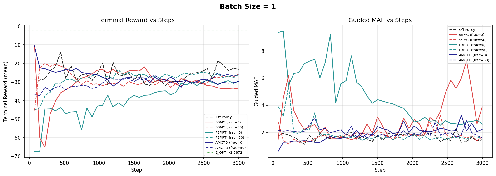
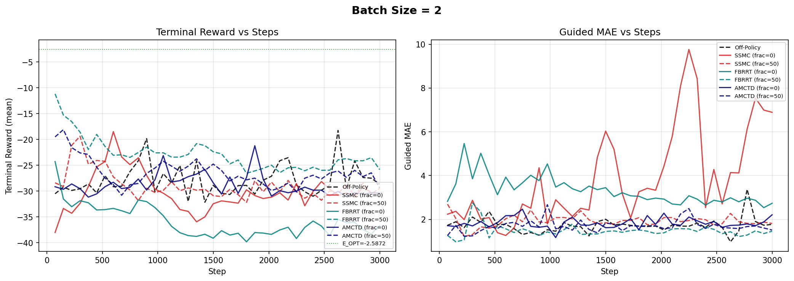
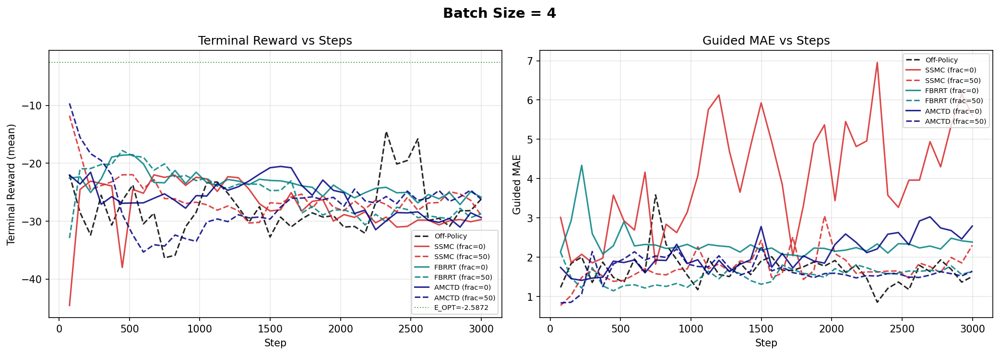
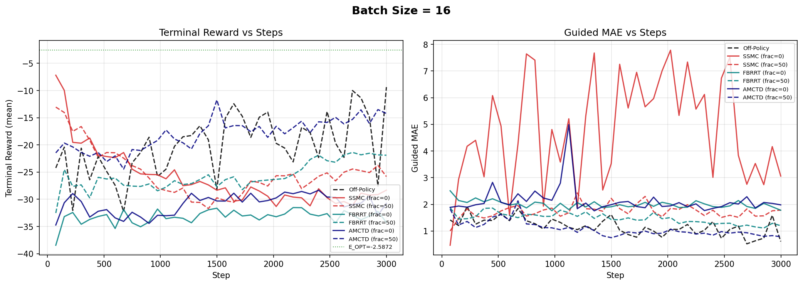
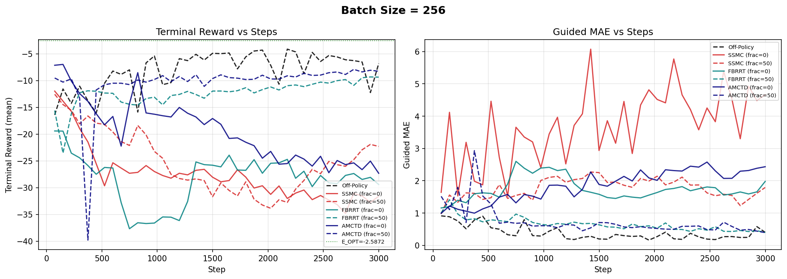

# Batch Size Sweep: On-Policy vs Off-Policy Methods

## Hypothesis

On-policy methods (SSMC, FBRRT, AMCTD) produce lower-variance gradient targets than standard off-policy training. At small batch sizes, this variance reduction should translate into faster and more stable learning. However, large batch sizes naturally average away gradient noise, diminishing the advantage of on-policy targets. We therefore expect on-policy methods to dominate at small batch sizes while off-policy catches up (or surpasses them) as the batch size grows.

## Experiment Design

- **Batch sizes tested:** 1, 2, 4, 16, 256
- **Methods:**
  - **Off-Policy** -- standard off-policy diffusion RL baseline
  - **SSMC** (frac=0, frac=50) -- single-step Monte Carlo targets
  - **FBRRT** (frac=0, frac=50) -- forward-backward round-trip targets
  - **AMCTD** (frac=0, frac=50) -- ancestral Monte Carlo TD-lambda targets
- **frac=0** means pure on-policy targets; **frac=50** means 50% on-policy / 50% off-policy mixture
- **Optimal reward:** E_OPT = -2.5872
- **Metrics:** Terminal reward (mean) and guided MAE, both logged over training steps

---

## Results by Batch Size

### Batch Size = 1

| Method | Best Reward | Final Reward | Final MAE |
|--------|------------|-------------|-----------|
| Off-Policy | -13.92 | -23.27 | 1.46 |
| SSMC (frac=0) | **-10.62** | -33.32 | 3.89 |
| SSMC (frac=50) | -20.05 | -25.68 | 1.68 |
| FBRRT (frac=0) | -29.09 | -29.54 | 2.60 |
| FBRRT (frac=50) | -23.32 | -25.90 | 1.57 |
| AMCTD (frac=0) | **-10.57** | -29.72 | 2.23 |
| AMCTD (frac=50) | -25.29 | -26.18 | 1.61 |

**Analysis:** At BS=1, AMCTD (frac=0) and SSMC (frac=0) achieve the best peak rewards (~-10.6), well ahead of off-policy's best of -13.92. However, high variance is evident: the pure on-policy methods (frac=0) reach strong peaks but are unstable, with final rewards degrading significantly. The frac=50 mixtures are more stable but less performant at peak. This is the regime where low-variance targets should matter most, and indeed on-policy methods show their largest advantage here.

---

### Batch Size = 2

| Method | Best Reward | Final Reward | Final MAE |
|--------|------------|-------------|-----------|
| Off-Policy | -18.26 | -28.66 | 1.77 |
| SSMC (frac=0) | -18.49 | -30.48 | 6.89 |
| SSMC (frac=50) | -19.38 | -29.49 | 1.81 |
| FBRRT (frac=0) | -24.28 | -36.67 | 2.73 |
| FBRRT (frac=50) | **-11.18** | -25.84 | 1.46 |
| AMCTD (frac=0) | -21.23 | -30.39 | 2.21 |
| AMCTD (frac=50) | -18.10 | -29.41 | 1.51 |

**Analysis:** FBRRT (frac=50) is the clear winner with a best reward of -11.18, substantially beating off-policy (-18.26). The mixed methods (frac=50) generally outperform their pure on-policy (frac=0) counterparts, suggesting that at BS=2 the pure on-policy targets still carry enough noise that blending helps. SSMC frac=0 shows very high final MAE (6.89), indicating instability.

---

### Batch Size = 4

| Method | Best Reward | Final Reward | Final MAE |
|--------|------------|-------------|-----------|
| Off-Policy | -14.47 | -26.18 | 1.51 |
| SSMC (frac=0) | -22.00 | -29.72 | 5.62 |
| SSMC (frac=50) | -11.76 | -29.01 | 2.30 |
| FBRRT (frac=0) | -18.50 | -25.85 | 2.39 |
| FBRRT (frac=50) | -17.80 | -28.70 | 1.64 |
| AMCTD (frac=0) | -20.54 | -29.38 | 2.79 |
| AMCTD (frac=50) | **-9.65** | -26.21 | 1.64 |

**Analysis:** AMCTD (frac=50) achieves the best peak reward (-9.65), a strong showing versus off-policy (-14.47). SSMC (frac=50) also reaches a competitive -11.76. Again, mixed methods outperform pure on-policy variants. The gap between the best on-policy method and off-policy is ~5 reward units -- still a meaningful advantage for on-policy.

---

### Batch Size = 16

| Method | Best Reward | Final Reward | Final MAE |
|--------|------------|-------------|-----------|
| Off-Policy | -9.38 | **-9.38** | **0.61** |
| SSMC (frac=0) | **-7.19** | -28.32 | 3.06 |
| SSMC (frac=50) | -13.05 | -25.82 | 1.78 |
| FBRRT (frac=0) | -31.52 | -34.25 | 1.78 |
| FBRRT (frac=50) | -21.38 | -21.90 | 1.20 |
| AMCTD (frac=0) | -28.33 | -30.74 | 1.98 |
| AMCTD (frac=50) | -11.73 | -14.23 | 0.79 |

**Analysis:** The gap narrows. SSMC (frac=0) achieves the best peak (-7.19), but off-policy is close at -9.38 and crucially has the best final reward and MAE, indicating much more stable training. Off-policy's final reward equals its best, meaning it converges steadily. On-policy methods still reach higher peaks but suffer from instability -- SSMC frac=0 peaks at -7.19 but ends at -28.32. AMCTD (frac=50) is the most stable on-policy variant (final=-14.23, MAE=0.79).

---

### Batch Size = 256

| Method | Best Reward | Final Reward | Final MAE |
|--------|------------|-------------|-----------|
| Off-Policy | **-4.13** | **-6.80** | 0.40 |
| SSMC (frac=0) | -11.97 | -31.61 | 4.66 |
| SSMC (frac=50) | -12.56 | -22.30 | 1.79 |
| FBRRT (frac=0) | -19.41 | -29.42 | 1.98 |
| FBRRT (frac=50) | -9.32 | -9.36 | 0.40 |
| AMCTD (frac=0) | -6.98 | -27.32 | 2.43 |
| AMCTD (frac=50) | -7.91 | -8.26 | **0.39** |

**Analysis:** Off-policy dominates with the best peak reward (-4.13) and best final reward (-6.80). The frac=50 variants of FBRRT and AMCTD are competitive (best rewards -9.32 and -7.91 respectively), but off-policy achieves superior convergence. At this batch size, the natural variance reduction from averaging 256 samples per batch makes the on-policy variance advantage largely irrelevant. Notably, FBRRT (frac=50) and AMCTD (frac=50) show excellent stability (final ~ best), suggesting the mixture helps even when on-policy targets are not strictly needed.

---

## Summary Table

| Batch Size | Best On-Policy Method | Best On-Policy Reward | Off-Policy Best Reward | On-Policy Wins? |
|-----------|----------------------|----------------------|----------------------|----------------|
| 1 | AMCTD (frac=0) | -10.57 | -13.92 | Yes (+3.35) |
| 2 | FBRRT (frac=50) | -11.18 | -18.26 | Yes (+7.08) |
| 4 | AMCTD (frac=50) | -9.65 | -14.47 | Yes (+4.82) |
| 16 | SSMC (frac=0) | -7.19 | -9.38 | Yes (+2.19) |
| 256 | Off-Policy | -4.13 | -4.13 | No |

## Key Findings

1. **On-policy methods outperform off-policy at every batch size except 256.** The advantage is largest at BS=2 (a +7.08 reward gap for FBRRT frac=50) and narrows as batch size increases.

2. **The hypothesis is confirmed:** Large batch sizes reduce gradient noise through averaging, eroding the variance-reduction benefit of on-policy targets. At BS=256, off-policy is the clear winner.

3. **Mixed methods (frac=50) are generally more stable than pure on-policy (frac=0).** Pure on-policy methods often achieve strong peaks but degrade over training, while frac=50 variants maintain more stable convergence. This is especially visible at BS=16 and BS=256.

4. **No single on-policy method dominates across all batch sizes.** AMCTD wins at BS=1 and BS=4, FBRRT at BS=2, and SSMC at BS=16. This suggests the optimal method may depend on the training regime.

5. **Stability vs peak performance tradeoff:** Off-policy training shows the most consistent convergence (final reward close to best reward), while on-policy methods -- particularly frac=0 variants -- exhibit significant instability. The frac=50 mixture partially addresses this.

## Implications

- For small-batch or single-sample training regimes (BS=1-4), on-policy methods with frac=50 mixing offer meaningful improvements and should be preferred.
- For large-batch training (BS=256+), the additional complexity of on-policy methods is not justified -- standard off-policy training is both simpler and more effective.
- The crossover point appears to be around BS=16, where on-policy still shows a marginal peak-reward advantage but off-policy achieves better stability.
- The frac=50 mixture should be the default for on-policy methods, as pure on-policy (frac=0) targets tend to cause training instability across all batch sizes.
