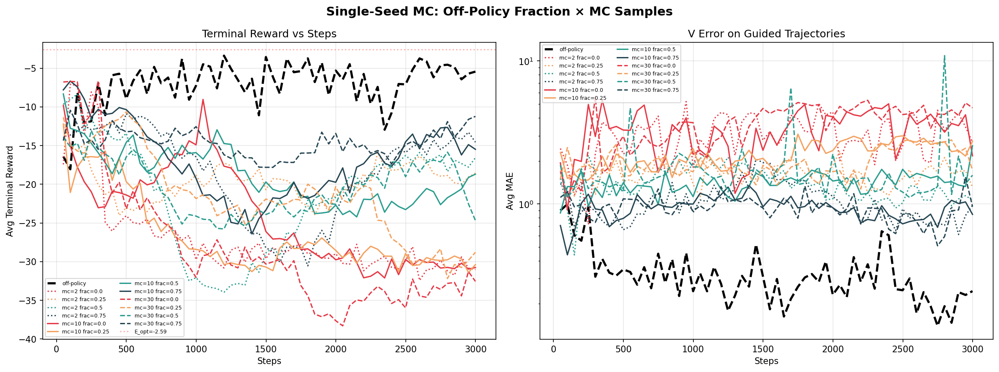

# mc_samples Sweep: Impact of Particle Count on Training Performance

## Setup

We sweep `mc_samples_per_step` ∈ {2, 5, 10, 20, 40} for `ancestral_td_lambda` at λ=0 (equivalent to `one_step_bootstrap` with the duplicate-averaging fix) using `smc=reward`. Off-policy is the baseline.

**Controlling for total particles**: Each dataset call produces `ds_batch × mc_samples × (n_steps+1)` training samples. We hold `ds_batch × mc_samples = 320` constant, so the total data volume per call is the same across runs. All runs use 6000 gradient steps with `loader_batch_size=256`.

| Run | mc_samples | ds_batch | particles/call |
|-----|--------:|--------:|--------:|
| offpolicy | — | — | — |
| mc2 | 2 | 160 | 320 |
| mc5 | 5 | 64 | 320 |
| mc10 | 10 | 32 | 320 |
| mc20 | 20 | 16 | 320 |
| mc40 | 40 | 8 | 320 |

Code: [mc_samples_sweep.py](mc_samples_sweep.py)

## Results

| Run | mc | Best Reward | Final Reward | Gap to E_opt |
|-----|---:|--------:|--------:|------:|
| **offpolicy** | **—** | **-3.16** | **-3.95** | **0.58** |
| **mc2** | **2** | **-7.32** | **-7.32** | **4.73** |
| mc5 | 5 | -15.01 | -23.64 | 12.42 |
| mc10 | 10 | -17.46 | -32.37 | 14.87 |
| mc20 | 20 | -15.42 | -28.50 | 12.84 |
| mc40 | 40 | -20.02 | -20.02 | 17.44 |



## Analysis

**Fewer mc_samples is better** — `mc=2` is the clear winner among on-policy runs, and performance degrades monotonically as mc_samples increases.

This is counterintuitive: more mc_samples means better child-averaging (lower variance per target), which our data_quality_v2 analysis showed improves target quality. But it comes at a steep cost in **exploration diversity**.

### The tradeoff: averaging quality vs exploration diversity

At fixed total particle count (320), increasing mc_samples means:

| | mc=2 | mc=40 |
|---|---|---|
| Independent parent trajectories | 160 | 8 |
| Children per parent | 2 | 40 |
| Target variance reduction | ~√2 | ~√40 |
| Unique (x, t) positions explored per call | ~160 × 101 | ~8 × 101 |

With `mc=2`, the model sees 160 independent SMC trajectories per dataset call — each exploring different regions of state space. The child-averaging is modest (2 children), but the training signal is diverse.

With `mc=40`, the model sees only 8 independent trajectories. The targets are very well-averaged (40 children), but the model trains on essentially the same 8 trajectories repeatedly within each batch. This creates an **exploration bottleneck**: the value function overfits to a narrow corridor of state space.

### Why averaging quality has diminishing returns

At λ=0, the target for parent x at time t is:

```
target = log_mean_exp_{children j of x} V(x_next_j, t+dt)
```

The variance of this target scales as `σ² / N` where N is the number of children. Going from N=1 to N=2 halves the variance — a large gain. But going from N=10 to N=40 only reduces variance by 4× — and the exploration cost of having 5× fewer parents far outweighs this.

### Implication for previous experiments

All previous training experiments used `mc_samples=10, ds_batch=32` (320 particles/call). The results here suggest `mc_samples=2, ds_batch=160` would have been significantly better. This may explain why on-policy methods struggled to match off-policy in earlier experiments — the mc_samples=10 setting was suboptimal.

### Recommendation

For on-policy training with `ancestral_td_lambda` at low λ:
- **Use `mc_samples=2`** (or possibly even 1, untested) with a proportionally larger `ds_batch`
- The priority is **maximizing the number of independent parent trajectories**, not improving per-target averaging
- Child-averaging provides diminishing returns beyond N≈2, while exploration diversity scales linearly with ds_batch
