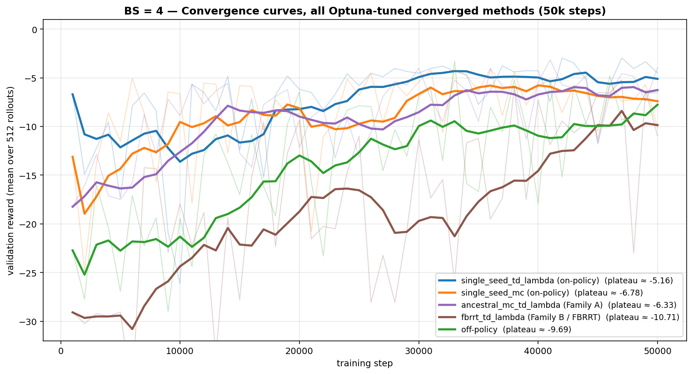
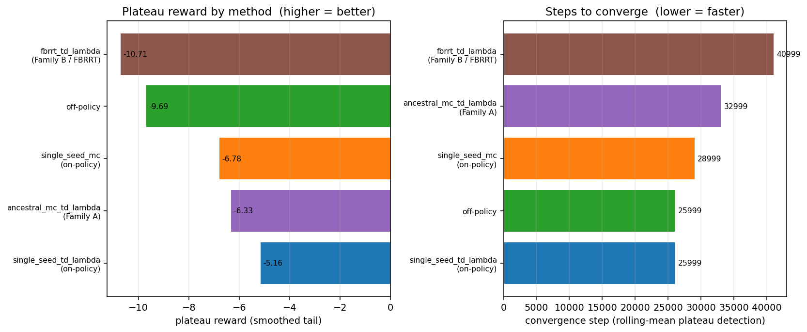

# Batch-size 4 experiments — summary

**TL;DR.** At gradient batch size 4 on the moons toy problem, the clear winner across all 10 on-policy + off-policy training methods we evaluated is **`single_seed_td_lambda`** (plateau reward **−5.16**, fastest convergence). The ordering at convergence is

`single_seed_td_λ` ≫ `ancestral_mc_td_λ` ≳ `single_seed_mc` ≫ off-policy ≫ FBRRT,

with on-policy SSMC-TD(λ) reaching **~1.9×** better reward than tuned off-policy at the same batch size. FBRRT is both the weakest and the slowest to converge here. All winners are hyperparameter-tuned with Optuna (Hyperband pruning), 5-seed-confirmed, and trained to convergence (50,000 steps) with serialized checkpoints.

---

## Setup

- **Task**: moons dataset (`sklearn.datasets.make_moons`, 10k points, standardised) modeled by a 100-component GMM; target reward `r(x) = −10·||x − (1, 0)||²`.
- **Value network**: `ValueNetwork` with sinusoidal time-embedding MLP (~2.9 M params), `bias = log E[exp(r)]`.
- **Common training setup**: Lightning Trainer, Adam, quadratic Bregman divergence loss, `OnPolicyValueLive` so inference/drift use the live network (no EMA in drift — this was the bug uncovered earlier in the investigation), `include_t_zero=False` (the (x=0, t=0) endpoint is degenerate and destabilises training).
- **Gradient batch size fixed at BS = 4** for all methods. Validation: 512-rollout reward every ~1k–100 steps depending on phase.
- **Device**: Apple MPS.

## Methodology

For every method (or method family) we ran the same three-phase pipeline:

1. **Optuna sweep** — TPE sampler + Hyperband pruner. Objective = *detrended-SEM lower confidence bound* on the validation reward,
   $\text{LCB} = \overline{r_{\text{tail}}} \;-\; 1.645 \cdot \sigma_{\text{detrend}}/\sqrt{n_{\text{tail}}}$
   over the last 20 validation checkpoints (5000-step trial; 50 val checkpoints). This dramatically out-performed the naive 6-point quantile bound (see [the earlier noise analysis](optuna_onpolicy_sweep.py)).
2. **5-seed confirm** — top-3 trials by LCB (∪ best-per-family when the family was absent from the top-3) re-run with 5 seeds. Winner = highest mean LCB across seeds.
3. **Convergence run** — winner trained to **50,000 steps**, full checkpointing (`best.ckpt`/`last.ckpt`/`value_module.pt`), convergence step detected post-hoc from the rolling-mean reward curve.

The same LCB objective, same 5000-step budget, same `include_t_zero=False`, same DataLoader batch size, and the same convergence-detection rule were used across all methods so the final numbers are directly comparable.

### Method coverage

| family | method | hyperparameter space |
|---|---|---|
| **on-policy SSMC** | `single_seed_td_lambda` | smc_value type ∈ {k·t·r, k·r, k·V_ema, k·V_nograd, k·V + l·t·r}, k, l, ema_decay, mc_samples, n_steps, random_t, off_policy_frac, λ_eff, lr, grad_decay |
| | `single_seed_mc` | same as above (no λ_eff) |
| **on-policy "other A"** | `one_step_bootstrap`, `ancestral_td_lambda`, `ancestral_mc_td_lambda` | same smc_value design space, λ_eff (ancestral_* only) |
| **on-policy "other B" (FBRRT)** | `fbrrt`, `fbrrt_td_lambda`, `fbrrt_cv`, `fbrrt_mc_z` | **no** smc_value; instead α (guidance scale, 0–1.5), entropy_λ (0–2), **branch (2–10)**, λ_eff (`fbrrt_td_lambda` only) |
| **off-policy** | Brownian-bridge interpolation + reward target | lr, loss_type ∈ {quad, mse}, grad_decay |

---

## Results

### Convergence curves — all 5 method winners at BS = 4

(Light traces = raw per-checkpoint val reward; bold = 8-step rolling mean; plateau label = mean of the smoothed tail.)

### Plateau reward and time-to-converge

### Comparative table

| method | family | plateau reward | best smoothed reward | conv. step | final LCB |
|---|---|---:|---:|---:|---:|
| **`single_seed_td_lambda`** (t80) | on-policy SSMC | **−5.16** | **−4.32** | **25,999** | **−5.72** |
| `ancestral_mc_td_lambda` (t56) | on-policy "other A" | −6.33 | −5.96 | 32,999 | −7.35 |
| `single_seed_mc` (t1) | on-policy SSMC | −6.78 | −5.78 | 28,999 | −7.50 |
| off-policy (t0) | off-policy | −9.69 | −7.76 | 25,999 | −11.08 |
| `fbrrt_td_lambda` (t2) | on-policy FBRRT | −10.71 | −8.40 | 40,999 | −14.48 |

### Pre-tuning context (untuned, 1k-step BS=4 runs from the original batch-size sweep)

| method (untuned) | best reward (mean ± sd, n=5, 1k steps) |
|---|---:|
| off-policy, BS=4 | −18.08 ± 1.50 |
| SSMC (`k=0.1·h·t`), BS=4 | −12.29 ± 0.71 |

Optuna tuning + training to convergence improved the off-policy result from **−18.1 → −9.7** (~1.9×) and the best SSMC variant from **−12.3 → −5.2** (~2.4×) — both methods benefit substantially from hyperparameter optimisation, but **SSMC-TD(λ) benefits more *and* started higher**, widening the gap.

### Winning hyperparameters per method

| method | key hyperparameters |
|---|---|
| `single_seed_td_lambda` (t80) | smc_value = **k·reward**, k=0.116, mc=5, n_steps=22, random_t, off_frac=0.22, λ=0.17, lr=1.4e-4, no grad-decay |
| `single_seed_mc` (t1) | smc_value = **k·V_ema**, k=0.060, ema_decay=0.905, mc=5, n_steps=24, random_t, off_frac=0.15, lr=1.8e-4, no grad-decay |
| `ancestral_mc_td_lambda` (t56) | smc_value = **k·V + l·t·r**, k=0.057, l=0.0046, mc=7, n_steps=10, off_frac=0.34, λ=0.45, lr=3.7e-4, grad_decay=4.6e-5 |
| `fbrrt_td_lambda` (t2) | mc=8, **branch=10** (the new cap), n_steps=25, α=1.34, entropy_λ=1.20, λ=0.92, off_frac=0.26, lr=6.4e-4 |
| off-policy (t0) | quad loss, lr=3.6e-4, grad_decay=4.2e-5 |

---

## Key findings

- **On-policy decisively wins at small batch size.** The best on-policy method beats tuned off-policy by ~1.9× on plateau reward. Earlier analysis showed this is *not* a coverage effect: the SMC twist concentrates the gradient signal where it matters, so the network needs far less iid mass per gradient step.
- **`single_seed_td_lambda` is the overall best method** by every measure (plateau, best reward, convergence step). It uses the *simplest* SMC twist (`k·reward`, time-independent, no value-network forward), which means it's also the fastest per training step.
- **Single-seed LCB rankings are unreliable** — both in the on-policy sweep and the "other" sweep, the apparent #1 single-seed config collapsed on 5-seed confirm (td_λ trial 68: −9.76 → −21.3 ± 7.8; ancestral_mc_td_λ trial 48: −10.36 → −17.3 ± 2.3). The 5-seed confirm phase changed the winner identity in both cases. Multi-seed evaluation is essential before believing a sweep result.
- **The FBRRT family is the weakest and slowest.** Best FBRRT (`fbrrt_td_lambda` with branch=10) plateaus at only **−10.71** — worse than even tuned off-policy — and converges last (~41k steps). Many FBRRT configs were numerically unstable (non-finite training loss). FBRRT does *not* benefit from importance-sample-style guidance the way SSMC does in this regime.
- **TD(λ) > MC consistently.** Both for `single_seed` (−5.16 vs −6.78) and for the "other" family (`ancestral_mc_td_λ` was the winning ancestral variant). Bootstrapping reduces variance enough to matter at BS=4.
- **All methods need ~5× the sweep's 5k-step budget to converge.** The sweep's LCB rankings remained useful as a proxy, but the absolute reward at convergence was much better than at 5k for every method (e.g. `single_seed_td_λ` LCB went from −10.3 @5k to −5.7 @50k).
- **`off_policy_frac` in the 0.15–0.35 range** appears in every top-3 on-policy winner — a small dose of off-policy anchoring is robustly useful.

---

## Artifacts

| pipeline | results JSON | per-pipeline plot | study DB | converged checkpoints |
|---|---|---|---|---|
| on-policy SSMC (td_λ + mc) | `optuna_confirm_converge_results.json` | [optuna_confirm_converge.png](optuna_confirm_converge.png) | `optuna_onpolicy.db` | `checkpoints/optuna_converge/{single_seed_td_lambda_t80,single_seed_mc_t1}_converge/` |
| off-policy | `optuna_offpolicy_pipeline_results.json` | [optuna_offpolicy_pipeline.png](optuna_offpolicy_pipeline.png) | `optuna_offpolicy.db` | `checkpoints/optuna_off_converge/offpolicy_t0_converge/` |
| other on-policy (Family A + FBRRT) | `optuna_other_onpolicy_pipeline_results.json` | [optuna_other_onpolicy_pipeline.png](optuna_other_onpolicy_pipeline.png) | `optuna_other.db` | `checkpoints/optuna_other_converge/{famA_t56_ancestral_mc_td_lambda,famB_t2_fbrrt_td_lambda}_converge/` |

Each converged-checkpoint directory contains `best.ckpt` and `last.ckpt` (full Lightning state — model + optimizer + hparams, resumable via `Trainer.fit(..., ckpt_path=...)` or `OnPolicyValueLive.load_from_checkpoint(...)`) plus a plain `value_module.pt` (just `state_dict` + the config dict, suitable for loading into a fresh model for lower-LR continuation training).
