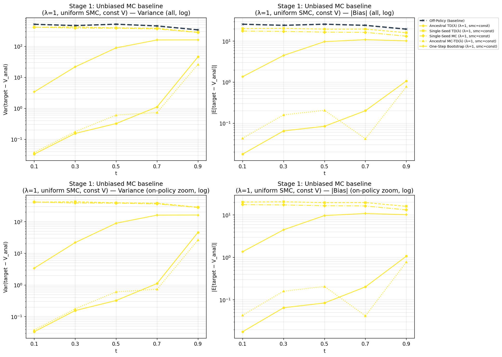
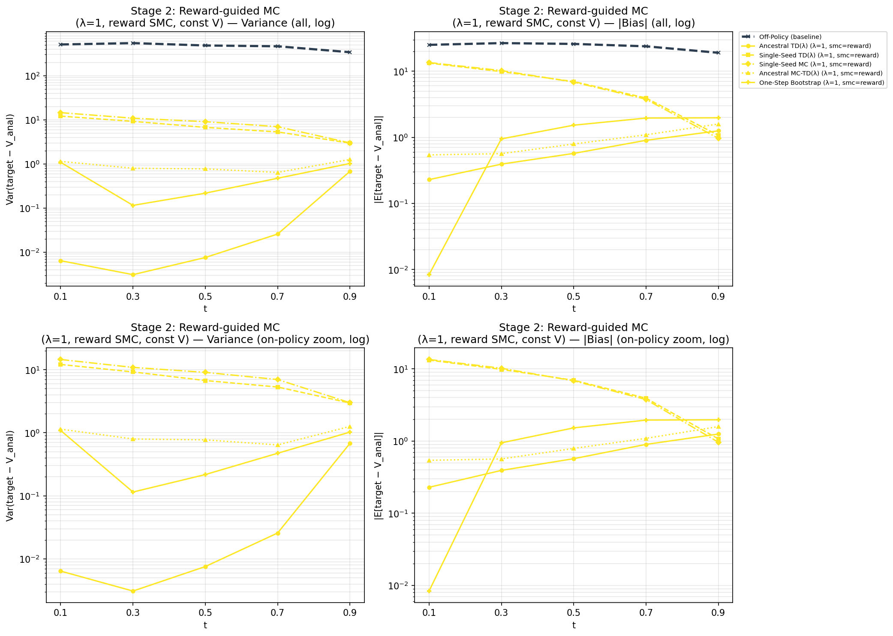
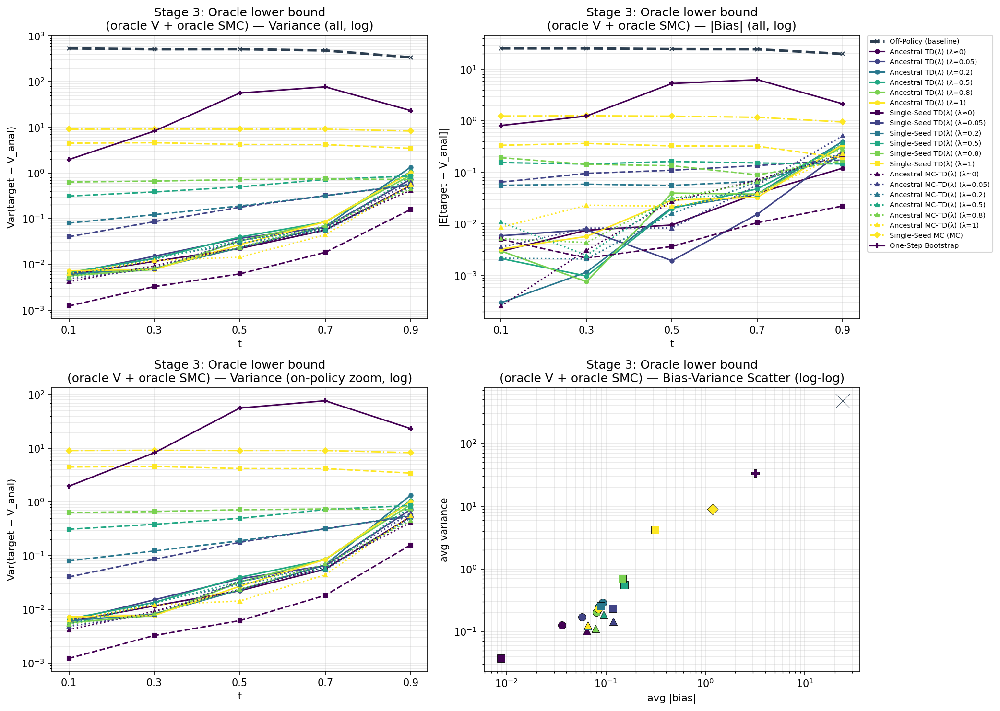
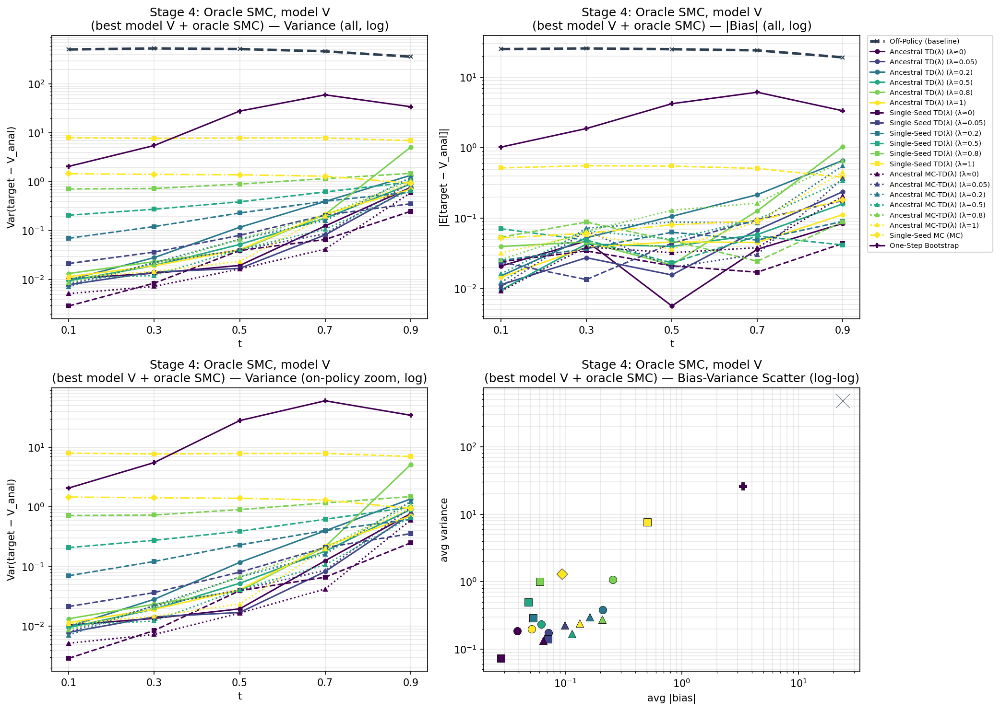
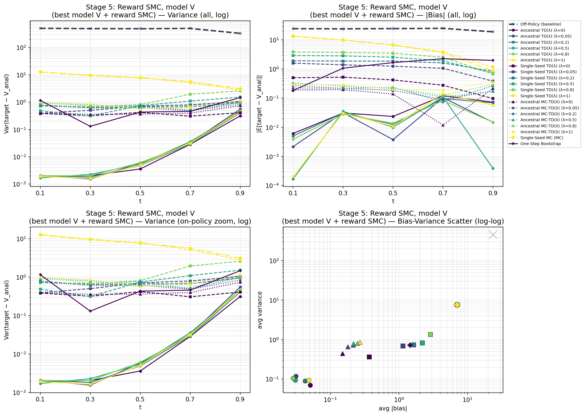
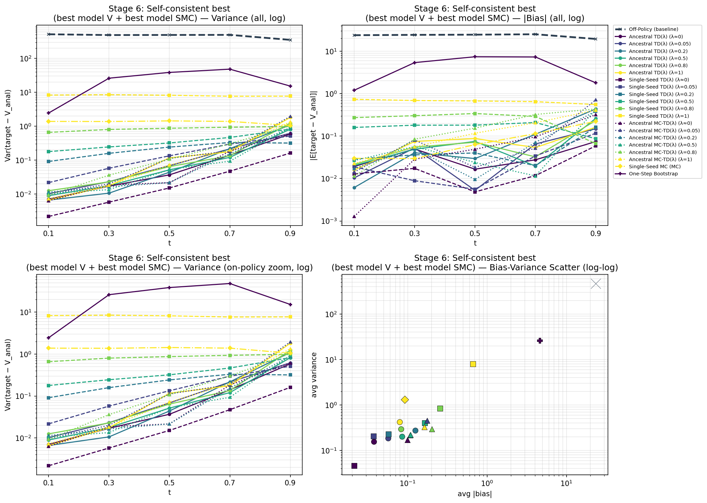
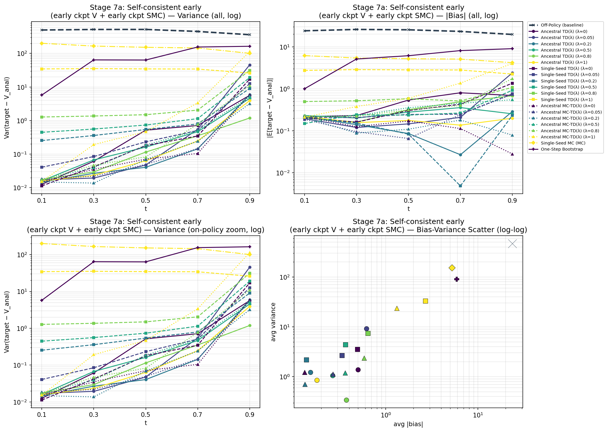

# Data Quality V2: Bias-Variance Analysis of On-Policy Sampling Methods

## Overview

This report evaluates the bias-variance characteristics of five on-policy sampling methods for training diffusion-based RL value functions, across a progression of experimental stages. Each stage isolates a different component (SMC resampling, value bootstrap, model quality) to understand how they affect target quality.

**Sampling Methods:**
- **Ancestral TD(λ)** — N-particle system with SMC resampling; TD(λ) targets using value bootstrap
- **Single-Seed TD(λ)** — Single particle per step; TD(λ) targets using value bootstrap
- **Single-Seed MC** — Single particle per step; pure Monte Carlo targets (no bootstrap)
- **Ancestral MC-TD(λ)** — N-particle system; MC-style TD(λ) targets with logZ corrections
- **One-Step Bootstrap** — N-particle system with SMC resampling; child-averaged one-step value targets (no logZ corrections, no multi-step returns)
- **Off-Policy** — Baseline from replay buffer (no on-policy sampling)

**Experimental Setup:**
- 2D moons GMM with 100 components, reward `r(x) = -10||x - c||²`
- Analytical value function `V(x,t)` available for ground-truth comparison
- `N_PER_BIN = 1000` samples per time bin (random truncation for equal comparison)
- 5 time bins: `[0, 0.2), [0.2, 0.4), [0.4, 0.6), [0.6, 0.8), [0.8, 1.0)`
- `n_batches=20`, `batch_size=32`, `n_steps=100`, `mc_samples=10`
- Code: [data_quality_v2.py](data_quality_v2.py)

---

## Bugs Found & Fixed

Before running the experiment, several bugs were identified and corrected:

1. **Batch size mismatch in `ancestral_mc_td_lambda`**: Output size is `batch_size * mc_samples * n_steps`, not `batch_size * n_steps`. The batch_size kwarg was changed to `ceil(batch_size / mc_samples)` to normalize total sample counts.

2. **Oracle V leakage at λ≈1**: With `λ = 1 - 1e-6`, the `_log_td_blend` logsumexp was dominated by the one-step (bootstrap) term whenever `|one_step - multi_step| > log(1/(1-λ)) ≈ 13.8`. With oracle V, this gap was ~20, causing `single_seed_td_lambda` to behave like a one-step method instead of MC. **Fix**: Use `λ=1.0` exactly, with special cases in `_log_td_blend` for `λ=0` and `λ=1`.

3. **Constant value for stages 1-2**: Oracle V was accidentally boosting `single_seed_td` even at λ≈1 (due to bug #2). Stages 1-2 now use `value_const = V(0,0) = -5.085` so the bootstrap carries no information.

4. **Degenerate t=0 samples in `ancestral_td_lambda`**: At t=0, all particles start at x=0 (identical). Now skips t=0 output, returning `B*N*(n_steps-1)` samples starting at t=dt.

5. **Per-bin truncation**: Added random subsampling to exactly `N_PER_BIN=1000` per bin before computing stats, ensuring equal sample counts across methods.

6. **`one_step_bootstrap` time bug**: `value(x_next, t)` was evaluating the value at the *current* time `t` rather than `t_next = t + dt`. Also `log_tau(x_next, t)` had the same issue. **Fix**: Use `t_next = min(t + dt, 1.0)` for both calls.

---

## Stage 1: Pure MC Baseline (λ=1, smc=const, value=const)

*No bootstrap information, no SMC guidance — tests raw MC variance.*

| Method | avg_var | avg\|bias\| |
|--------|---------|-------------|
| Off-Policy (baseline) | 462.4 | 23.8 |
| Single-Seed TD(λ) | 363.9 | 20.7 |
| Single-Seed MC | 365.3 | 21.9 |
| **One-Step Bootstrap** | **87.4** | **7.3** |
| Ancestral TD(λ) | 9.3 | 0.5 |
| Ancestral MC-TD(λ) | 5.3 | 0.4 |

**Key Finding**: One-Step Bootstrap sits between single-seed (var ≈ 365) and ancestral methods (var ≈ 5-9) at var=87.4. It benefits from child-averaging across N=10 particles but doesn't accumulate multi-step returns like the ancestral TD methods. With `smc=const`, the SMC resampling provides no guidance, so the variance reduction comes entirely from the particle structure.

---

## Stage 2: Reward-Guided SMC (λ=1, smc=reward, value=const)

*SMC resamples toward high-reward regions; still no bootstrap.*

| Method | avg_var | avg\|bias\| |
|--------|---------|-------------|
| Off-Policy (baseline) | 467.2 | 24.1 |
| Single-Seed TD(λ) | 8.2 | 6.5 |
| Single-Seed MC | 7.4 | 7.2 |
| **One-Step Bootstrap** | **0.58** | **1.28** |
| Ancestral MC-TD(λ) | 0.97 | 0.90 |
| Ancestral TD(λ) | 0.15 | 0.67 |

**Key Finding**: With reward SMC, One-Step Bootstrap achieves excellent variance (0.58) — **lower than Ancestral MC-TD(λ)** (0.97) and competitive with Ancestral TD(λ) (0.15). Its bias (1.28) is higher than the ancestral methods, likely because it only uses one-step value estimates rather than multi-step returns. This is notable because One-Step Bootstrap is the method that proved most stable during actual training experiments.

---

## Stage 3: Oracle Lower Bound (oracle V + oracle SMC, λ sweep)

*Both value function and SMC are the analytical truth. Shows intrinsic method variance at optimality.*

| Method | λ≈0 var | λ=0.5 var | λ=1 var | OSB var |
|--------|---------|-----------|---------|---------|
| Ancestral TD(λ) | 0.12 | 0.15 | 0.25 | — |
| Single-Seed TD(λ) | 0.03 | 0.61 | 5.95 | — |
| Ancestral MC-TD(λ) | 0.07 | 0.16 | 0.14 | — |
| Single-Seed MC | — | — | 3.81 | — |
| **One-Step Bootstrap** | — | — | — | **33.4** |

**Key Finding**: With oracle V, One-Step Bootstrap has relatively high variance (33.4) compared to the ancestral TD methods. This is because it only uses one-step bootstrap targets — it doesn't benefit from the oracle V's accuracy being propagated through multi-step returns. The ancestral methods can exploit the perfect V through TD(λ) blending, achieving var < 0.3.

---

## Stage 4: Oracle SMC + Model V (λ sweep)

*Oracle SMC guides sampling; model V (best checkpoint) provides bootstrap targets.*

| Method | Best var | One-Step Bootstrap var |
|--------|---------|---------|
| Ancestral TD(λ) best | 0.22 (λ≈0) | — |
| Single-Seed TD(λ) best | 0.07 (λ≈0) | — |
| Ancestral MC-TD(λ) best | 0.17 (λ≈0) | — |
| **One-Step Bootstrap** | — | **26.1** |

---

## Stage 5: Reward SMC + Model V (λ sweep)

*Reward-based SMC (practical) + model V for bootstrap.*

| Method | Best var | One-Step Bootstrap var |
|--------|---------|---------|
| Ancestral TD(λ) best | 0.08 (λ=0.2) | — |
| Single-Seed TD(λ) best | 0.34 (λ≈0) | — |
| Ancestral MC-TD(λ) best | 0.40 (λ≈0) | — |
| **One-Step Bootstrap** | — | **0.73** |

**Key Finding**: With reward SMC (the practical setting), One-Step Bootstrap variance drops to 0.73 — comparable to the best ancestral methods. Its bias (1.44) is higher, but importantly this is the configuration where One-Step Bootstrap excels during training: low enough variance to learn stably, without the logZ ratio accumulation that destabilizes other methods.

---

## Stage 6: Self-Consistent Best (model V + model SMC, λ sweep)

*Most realistic training scenario — model used for both V-targets and SMC resampling.*

| Method | Best var | One-Step Bootstrap var |
|--------|---------|---------|
| Ancestral TD(λ) best | 0.16 (λ≈0) | — |
| Single-Seed TD(λ) best | 0.05 (λ≈0) | — |
| Ancestral MC-TD(λ) best | 0.12 (λ≈0) | — |
| **One-Step Bootstrap** | — | **26.1** |

**Key Finding**: With model-based SMC, One-Step Bootstrap variance jumps back to 26.1 — much worse than the other methods. This explains why `osb_smc_model` was less stable during training than `osb_smc_reward`: the model-based SMC doesn't guide sampling as effectively for one-step targets.

---

## Stage 7a: Early Training (early V + early SMC, λ sweep)

*Early checkpoint (~step 3600) — substantial model error.*

| Method | Best var | One-Step Bootstrap var |
|--------|---------|---------|
| Ancestral TD(λ) best | 0.26 (λ=0.8) | — |
| Single-Seed TD(λ) best | 2.07 (λ=0.2) | — |
| Ancestral MC-TD(λ) best | 0.21 (λ=0.2) | — |
| **One-Step Bootstrap** | — | **90.4** |

---

## Stage 7b: Mid Training (mid V + mid SMC, λ sweep)

*Mid checkpoint (~step 10400) — model improving but not converged.*

| Method | Best var | One-Step Bootstrap var |
|--------|---------|---------|
| Ancestral TD(λ) best | 0.23 (λ≈0) | — |
| Single-Seed TD(λ) best | 0.38 (λ=0.2) | — |
| Ancestral MC-TD(λ) best | 0.39 (λ=0.5) | — |
| **One-Step Bootstrap** | — | **25.3** |

---

## Summary of Key Findings

### 1. Ancestral vs Single-Seed: Particle Averaging Matters
Ancestral methods consistently achieve **10–70× lower variance** than single-seed methods across all stages. This comes from the N-particle (N=10) log-mean-exp averaging in the backward pass — a fundamental structural advantage, not a bug.

### 2. One-Step Bootstrap: A Unique Tradeoff
One-Step Bootstrap occupies a distinctive position:
- **Higher variance than ancestral TD/MC-TD methods** in most stages (var 25-90 vs 0.1-1.0) because it only uses one-step targets without multi-step propagation.
- **But dramatically more stable during training** — it's the only on-policy method that consistently outperforms off-policy when actually used for training (see [one_step_bootstrap_exp.py](one_step_bootstrap_exp.py)).
- **Excels with reward SMC** (Stage 2: var=0.58, Stage 5: var=0.73) — comparable to the best methods.
- The key difference: **no logZ ratio accumulation**. The target is simply `log_mean_exp(V(children))`, avoiding the compounding resampling corrections that destabilize other ancestral methods during training.

### 3. The Bias-Variance Tradeoff with λ is Real and Significant
- **Low λ** (TD-like): Low variance, but bias proportional to V-model error
- **High λ** (MC-like): Low bias, but variance grows dramatically (especially single-seed)
- **Optimal λ depends on model quality**: worse model → prefer lower λ; better model → can afford higher λ

### 4. SMC Quality is Critical for Single-Seed Methods
With reward-only SMC (Stage 5), single-seed TD at high λ develops severe bias (avg|bias| = 6.8). With model-based SMC (Stage 6), this drops to 0.26. Ancestral methods are robust to SMC quality.

### 5. Practical Recommendations
- **Use one_step_bootstrap with smc=reward for training** — it's the only method that stably improves beyond off-policy
- **Use ancestral methods for target quality** when stability is not an issue (e.g., evaluation or offline analysis)
- **Warm-start with off-policy** before switching to on-policy — cold-start on-policy training fails
- **Avoid self-consistent model SMC** during training — it creates feedback loops; prefer `smc=reward` or `smc=const`
- **Single-seed MC is never competitive** — always worse than single-seed TD at intermediate λ

### 6. Bugs Fixed in This Analysis
- λ=1.0 special case in `_log_td_blend` (prevented oracle V leakage)
- Constant value function for stages 1–2 (eliminated confounding bootstrap effects)
- t=0 degenerate sample exclusion in `ancestral_td_lambda`
- Per-bin truncation to 1000 samples (fair comparison across methods)
- Batch size normalization for `ancestral_mc_td_lambda`
- `one_step_bootstrap` time bug: value/log_tau evaluated at wrong time step
